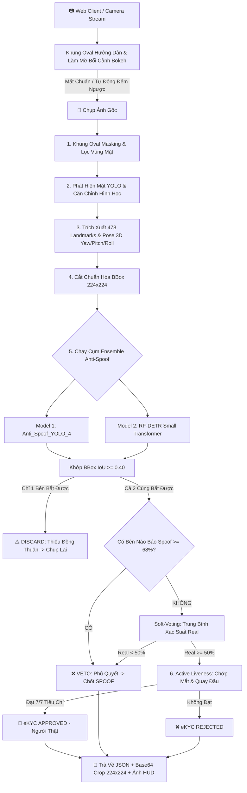

# 🛡️ Face-Project: Hệ Thống eKYC Face ID - Anti-Spoofing & Liveness Detection Pipeline

<p align="center">
  
  
  
  
  
  
  
  <a href="https://github.com/GiantKy/Face_project/actions/workflows/ci.yml">
    
  </a>
  <a href="https://gitlab.com/giaky0909/face_project_1/-/pipelines">
    
  </a>
</p>

Hệ thống xác thực danh tính và sinh trắc học khuôn mặt chuẩn FinTech / Ngân hàng (**eKYC Face Verification**). Tích hợp chuỗi xử lý khép kín: phát hiện khuôn mặt, trích xuất 478 điểm mốc 3D, căn chỉnh hình học, **phát hiện giả mạo đa tầng kết hợp Ensemble (YOLO_4 + RF-DETR Small Transformer)** và xác thực cử động sống chủ động (Active Liveness).

Hệ thống cung cấp cả **Giao diện Web AI Scanner hiện đại (Làm mờ ngoại vi Oval & Auto-Capture)**, **FastAPI Microservice** chuẩn hóa cho Backend Node.js/Java/Go, và **Script Desktop OpenCV** phục vụ nghiên cứu thực nghiệm.

---

## 📑 Mục Lục
1. [Link Tải Tất Cả Mô Hình AI (Google Drive)](#-link-tải-tất-cả-mô-hình-ai-google-drive)
2. [Tính Năng Nổi Bật](#-tính-năng-nổi-bật)
3. [Sơ Đồ Kiến Trúc Pipeline (Workflow)](#-sơ-đồ-kiến-trúc-pipeline-workflow)
4. [Cấu Trúc Thư Mục Dự Án](#-cấu-trúc-thư-mục-dự-án)
5. [Cài Đặt Môi Trường](#-cài-đặt-môi-trường)
6. [Cơ Chế Ensemble Anti-Spoofing & Veto Rule](#-cơ-chế-ensemble-anti-spoofing--veto-rule)
7. [Khung Oval Bokeh Masking & Web Live Pipeline](#-khung-oval-bokeh-masking--web-live-pipeline)
8. [Hướng Dẫn Sử Dụng & Khởi Chạy](#-hướng-dẫn-sử-dụng--khởi-chạy)
   - [Cách 1: Khởi chạy FastAPI AI Server & Web Portal](#1-khởi-chạy-fastapi-ai-server--web-portal-khuyên-dùng)
   - [Cách 2: Chạy kiểm thử tự động Test Suite](#2-chạy-kiểm-thử-tự-động-test-suite)
   - [Cách 3: Chạy bằng CLI Runner (Node.js IPC Bridge)](#3-chạy-bằng-cli-runner-nodejs-ipc-bridge)
   - [Cách 4: Chạy Pipeline Webcam Desktop OpenCV](#4-chạy-pipeline-webcam-desktop-opencv)
9. [Tài Liệu API Endpoints (FastAPI)](#-tài-liệu-api-endpoints-fastapi)
10. [Tích Hợp Backend Node.js](#-tích-hợp-backend-nodejs)
11. [Khắc Phục Sự Cố Thường Gặp (Troubleshooting)](#-khắc-phục-sự-cố-thường-gặp-troubleshooting)

---

## 📦 Link Tải Tất Cả Mô Hình AI (Google Drive)

Toàn bộ trọng số mô hình đã huấn luyện được lưu trữ tại Google Drive:

* 🔗 **Google Drive Repository:** [Google Drive - Face Project Models Folder](https://drive.google.com/drive/folders/1O7lqzhpJ8DE9x2AFzMyrd3M2-8sNdYBn)

### Bảng đối chiếu model sử dụng:
| Tên File Model | Vị trí trong Project | Kích thước | Chức năng chính |
|:---|:---|:---:|:---|
| `Face_Detection.pt` | `server_module/models/` & `models/` | ~19 MB | YOLO Face Detection tốc độ cao |
| `face_landmarker.task` | `server_module/models/` & `models/` | ~3.7 MB | Google MediaPipe Tasks 478 Landmarks |
| `Anti_Spoof_YOLO_4.pt` | `server_module/models/` & `models/` | ~6.2 MB | Model 1: YOLOv8 Face Anti-Spoof |
| `roboflow/**/weights.onnx` | `server_module/models/` & `models/` | ~108.9 MB | Model 2: RF-DETR Small Transformer |
| `Anti_Spoof_minifasnet.pth` | `models/` | ~240 KB | CNN MiniFASNetV2 PyTorch |
| `Model_MobilenetV2/` | `models/` | ~9 MB | MobileNetV2 Safetensors |

> [!NOTE]
> Thư mục `server_module/models/` đã được đóng gói tự chứa (self-contained) sẵn các model trọng số chính để máy chủ AI có thể chạy độc lập ngay mà không phụ thuộc thư mục gốc.

---

## 🌟 Tính Năng Nổi Bật

- **Lõi Ensemble 2 Model Độc Lập (YOLO_4 + RF-DETR Small):**
  - **IoU Bounding Box Matching ($\ge 0.40$):** Khớp nối vị trí khuôn mặt giữa mô hình CNN và Transformer.
  - **Quy tắc Phủ Quyết An Ninh (Strict Spoof Veto $\ge 68\%$):** Khi một trong 2 mô hình phát hiện dấu hiệu giả mạo với độ tự tin $\ge 68\%$, hệ thống lập tức phủ quyết thành **SPOOF** để ngăn chặn gian lận.
  - **Consensus Filtering (Lọc Đồng Thuận):** Khi chỉ có duy nhất 1 mô hình phát hiện mặt (mô hình kia `N/A`), hệ thống tự động loại bỏ ảnh (`DISCARD_NO_CONSENSUS`) và yêu cầu chụp lại.
- **Khung Oval Bokeh Masking (Làm Mờ Ngoại Vi Trừ Oval Ở Giữa):**
  - Làm mờ quang học (Gaussian Blur Bokeh 14px) và giảm sáng toàn bộ bối cảnh xung quanh, chỉ giữ sắc nét vùng khuôn mặt bên trong khung Oval.
  - Loại bỏ hoàn toàn sự can thiệp của người đứng sau hoặc các màn hình/ảnh giả mạo ngoại vi.
- **Quy Trình Pipeline Trực Tiếp Trên Web (Web Live Pipeline):**
  - Hỗ trợ xem trực tiếp camera trên trình duyệt.
  - Tự động đánh giá góc mặt 3D, khoảng cách và căn giữa oval real-time.
  - Tự động chụp (**Auto-Capture Countdown**) khi khuôn mặt đạt chuẩn trong 1.5 giây.
- **FastAPI AI Server Chuẩn Hóa:**
  - Cung cấp RESTful API, tự động sinh tài liệu tương tác **Swagger UI** và **ReDoc**.
  - Tiếp nhận cả Multipart Form-Data (File ảnh) lẫn JSON Base64 payload.
  - Trả về kết quả JSON chuẩn hóa gồm 7 tiêu chí, ảnh crop 224x224 và ảnh HUD annotated.

---

## 🔄 Sơ Đồ Kiến Trúc Pipeline (Workflow)



---

## 📁 Cấu Trúc Thư Mục Dự Án

```
Face-Project/
├── run_api_server.py                 # ⭐ Điểm khởi chạy FastAPI AI Server
├── requirements.txt                  # Danh sách dependencies đã chuẩn hóa
├── README.md                         # Tài liệu hướng dẫn dự án
├── TEST_NOTES.md                     # Sổ tay ghi chú kiểm thử chi tiết
│
├── server_module/                    # 🚀 MODULE AI SERVER & MICROSERVICE
│   ├── __init__.py                   # Export module API & version
│   ├── app.py                        # FastAPI Server & Routes definition
│   ├── config.py                     # Cấu hình ngưỡng AI & paths nội bộ
│   ├── ensemble_anti_spoof.py        # Cụm Ensemble (YOLO_4 + RF-DETR Small)
│   ├── anti_spoof_yolo.py            # Detector fallback YOLO
│   ├── pipeline_server.py            # Core Pipeline Headless (EKYCPipelineServer)
│   ├── runner.py                     # CLI Runner & Node.js IPC Bridge
│   ├── schemas.py                    # Pydantic V2 Schemas (Request/Response)
│   ├── utils.py                      # Oval Masking, Bokeh, IoU, Base64 & HUD
│   ├── nodejs_client_example.js      # Script mẫu gọi API từ Node.js
│   ├── models/                       # Thư mục trọng số tự chứa của server_module
│   │   ├── Anti_Spoof_YOLO_4.pt
│   │   ├── Face_Detection.pt
│   │   ├── face_landmarker.task
│   │   └── roboflow/.../weights.onnx
│   └── static/                       # 🌐 Giao diện Web Client Scanner
│       └── index.html                # Web App Oval Bokeh Blur & Auto-Capture
│
├── models/                           # Kho weights gốc phục vụ kiểm thử mở rộng
├── src/                              # Thư viện thuật toán cốt lõi
│   ├── face_detection/               # YOLO Face Detector
│   ├── landmark_detection/           # MediaPipe Landmarker
│   ├── pose_validation/              # 3D Euler Angles estimation
│   ├── face_alignment_crop/          # Affine transformation
│   └── head_movement/                # Liveness quay đầu
│
├── tests/                            # Bộ kiểm thử tích hợp & Unit Tests
│   ├── test_fastapi_server.py        # Test toàn diện 5 endpoint FastAPI
│   ├── test_server_module.py         # Test pipeline_server logic
│   ├── test_pipeline_ensemble_full.py# Test pipeline webcam OpenCV
│   └── ...                           # Các test case đơn lẻ khác
└── output/                           # Thư mục xuất artifacts & báo cáo JSON
```

---

## ⚙️ Cài Đặt Môi Trường

Khuyến nghị sử dụng **Python 3.10 hoặc 3.11** trên Windows hoặc Linux.

```bash
# 1. Tạo môi trường ảo
python -m venv venv

# 2. Kích hoạt môi trường
# Trên Windows PowerShell:
venv\Scripts\Activate.ps1
# Trên Linux / macOS:
source venv/bin/activate

# 3. Nâng cấp pip và cài đặt thư viện
python -m pip install --upgrade pip
pip install -r requirements.txt
```

---

## 🧠 Cơ Chế Ensemble Anti-Spoofing & Veto Rule

Cụm Ensemble giải quyết triệt để các trường hợp giả mạo tinh vi (ảnh in chất lượng cao, màn hình OLED/4K, video replay):

1. **Khớp nối Bounding Box (IoU Matching):**
   $$\text{IoU} = \frac{\text{Area}(\text{Box}_{YOLO} \cap \text{Box}_{RFDETR})}{\text{Area}(\text{Box}_{YOLO} \cup \text{Box}_{RFDETR})} \ge 0.40$$
2. **Quy tắc Phủ Quyết An Ninh (Strict Spoof Veto):**
   $$\text{Nếu } \max(\text{Conf}_{\text{YOLO\_Spoof}}, \text{Conf}_{\text{RFDETR\_Spoof}}) \ge 0.68 \implies \textbf{SPOOF (VETO)}$$
3. **Soft-Voting (Khi không kích hoạt Veto):**
   $$P_{\text{Real}} = 0.50 \times P_{\text{YOLO\_Real}} + 0.50 \times P_{\text{RFDETR\_Real}}$$
4. **Tiêu Chí Đồng Thuận (Dual-Model Agreement):** Cả 2 mô hình phải đồng thời nhận diện được khuôn mặt trong khung hình thì kết quả mới hợp lệ.

---

## 🎯 Khung Oval Bokeh Masking & Web Live Pipeline

* **Làm mờ ngoại vi trên Web Client:** Sử dụng CSS Backdrop-filter kết hợp SVG Radial Masking, làm mờ 14px toàn bộ bối cảnh ngoại vi trong thời gian thực (60 FPS), giữ vùng oval trong suốt rõ nét.
* **Làm mờ ngoại vi trên AI Server:** Hàm `get_oval_masked_frame()` áp dụng bộ lọc Gaussian Blur ($k=45$) và làm tối bối cảnh ($\times 0.35$), giúp mô hình AI chỉ tập trung suy luận vào khuôn mặt bên trong oval.
* **Auto-Capture Countdown:** Khi người dùng đưa mặt đúng vào giữa oval và góc mặt nhìn thẳng trong 1.5 giây, hệ thống tự động đếm ngược 3-2-1 và chụp ảnh thẩm định.

---

## 🚀 Hướng Dẫn Sử Dụng & Khởi Chạy

### 1. Khởi chạy FastAPI AI Server & Web Portal *(Khuyên dùng)*

Khởi động máy chủ AI bằng script launcher:
```bash
python run_api_server.py
```
Sau khi khởi động:
* **Giao diện Web eKYC Scanner:** Truy cập [http://127.0.0.1:8000/](http://127.0.0.1:8000/) trên trình duyệt.
* **Tài liệu API Swagger UI:** Truy cập [http://127.0.0.1:8000/docs](http://127.0.0.1:8000/docs).
* **Tài liệu API ReDoc:** Truy cập [http://127.0.0.1:8000/redoc](http://127.0.0.1:8000/redoc).

---

### 2. Chạy kiểm thử tự động Test Suite

* **Kiểm thử toàn bộ endpoint của FastAPI Server:**
  ```bash
  python tests/test_fastapi_server.py
  ```
* **Kiểm thử logic xử lý tĩnh của Server Module:**
  ```bash
  python tests/test_server_module.py
  ```

---

### 3. Chạy bằng CLI Runner (Node.js IPC Bridge)

Chạy trực tiếp từ dòng lệnh hoặc gọi từ tiến trình con (child_process):

* **Thẩm định eKYC toàn diện:**
  ```bash
  python server_module/runner.py --action full_verify --input "data_raw/0.jpg"
  ```
* **Kiểm tra riêng cụm Ensemble Anti-Spoof:**
  ```bash
  python server_module/runner.py --action check_antispoof --input "data_raw/0.jpg"
  ```
* **Kiểm tra góc mặt & tư thế (Pose):**
  ```bash
  python server_module/runner.py --action validate_pose --input "data_raw/0.jpg"
  ```

---

### 4. Chạy Pipeline Webcam Desktop OpenCV

Dành cho thử nghiệm tương tác truyền thống có cửa sổ OpenCV:
```bash
python tests/test_pipeline_ensemble_full.py --cam 0
```
* **Phím tắt:** `SPACE` hoặc `c` để chụp; `a` bật/tắt tự động chụp; `q` thoát.

---

## 📡 Tài Liệu API Endpoints (FastAPI)

### 1. `POST /api/v1/verify` (Xác thực eKYC toàn diện)
Hỗ trợ cả Multipart Form-Data lẫn JSON Base64 payload:

* **Tham số Request:**
  - `file`: File ảnh khuôn mặt (Multipart) hoặc `image_base64`: Chuỗi Base64 ảnh (JSON).
  - `img_id`: Mã phiên giao dịch (mặc định: `"1"`).
  - `apply_oval_mask`: `true` (mặc định) để làm mờ bối cảnh ngoại vi trừ oval.
  - `return_crop_image`: `true` để nhận ảnh crop 224x224 Base64.
  - `return_annotated_image`: `true` để nhận ảnh HUD Base64.
* **Cấu trúc JSON Response:**
  ```json
  {
    "success": true,
    "image_id": "WEB_1726543891",
    "timestamp": "2026-09-17 10:15:30",
    "approved": true,
    "verdict": "APPROVED",
    "is_real": true,
    "confidence": 0.842,
    "reasons": [],
    "criteria": {
      "face_detected": true,
      "single_face": true,
      "pose_valid": true,
      "anti_spoof_real": true,
      "both_models_detected": true,
      "blink_passed": true,
      "head_movement_passed": true
    },
    "face_detection": { "num_faces": 1, "primary_face": { "bbox": [180, 95, 460, 430], "confidence": 0.94 } },
    "pose_3d": { "is_valid": true, "yaw": -2.4, "pitch": 3.1, "roll": 0.8 },
    "ensemble_anti_spoof": {
      "label": "REAL",
      "is_real": true,
      "confidence": 0.842,
      "source": "ENSEMBLE",
      "agreement": true,
      "both_detected": true
    },
    "crop_face_base64": "data:image/jpeg;base64,...",
    "annotated_image_base64": "data:image/jpeg;base64,...",
    "processing_time_ms": 1780.5
  }
  ```

### 2. `POST /api/v1/validate-pose` (Kiểm tra góc mặt & căn chỉnh Oval)
Dành cho Web Client gửi frame thumbnail liên tục (4-5 lần/giây) để định vị khuôn mặt trước khi chụp.

### 3. `GET /api/v1/health` (Giám sát trạng thái máy chủ AI)
Trả về trạng thái sức khỏe máy chủ, tình trạng nạp model (`models_loaded: true`) và thiết bị tính toán (`device: "cpu"` hoặc `"cuda"`).

---

## 💻 Tích Hợp Backend Node.js

Node.js Backend có thể giao tiếp với AI Server qua HTTP API cực kỳ đơn giản:

```javascript
const axios = require('axios');
const fs = require('fs');
const FormData = require('form-data');

async function verifyEKYC(imageFilePath) {
  const form = new FormData();
  form.append('file', fs.createReadStream(imageFilePath));
  form.append('img_id', 'TXN_' + Date.now());
  form.append('apply_oval_mask', 'true');

  const response = await axios.post('http://127.0.0.1:8000/api/v1/verify', form, {
    headers: form.getHeaders(),
    timeout: 10000
  });

  const result = response.data;
  console.log('eKYC Result:', result.verdict); // APPROVED hoặc REJECTED
  console.log('Is Real:', result.is_real);
  console.log('Confidence:', (result.confidence * 100).toFixed(1) + '%');

  // Lưu ảnh crop khuôn mặt 224x224 vào Database/Storage
  const cropBase64 = result.crop_face_base64;
  return result;
}
```
*(Tham khảo thêm script mẫu đầy đủ tại [`server_module/nodejs_client_example.js`](server_module/nodejs_client_example.js)).*

---

## 🛠️ Khắc Phục Sự Cố Thường Gặp (Troubleshooting)

1. **Lỗi `ModuleNotFoundError: No module named 'numpy'`:**
   * *Nguyên nhân:* Môi trường dòng lệnh đang trỏ tới bản Python mặc định chưa kích hoạt `venv`.
   * *Khắc phục:* Kích hoạt đúng môi trường ảo (`venv\Scripts\activate`) hoặc chỉ định đường dẫn tuyệt đối tới bản Python 3.11 chứa thư viện.
2. **Cảnh báo `Specified provider 'CUDAExecutionProvider' is not in available provider names`:**
   * *Hiện tượng:* Máy tính chạy trên CPU hoặc Windows DirectML mà không có GPU NVIDIA.
   * *Khắc phục:* Đây chỉ là cảnh báo thông tin; hệ thống tự động chuyển sang `DmlExecutionProvider` hoặc `CPUExecutionProvider` hoạt động hoàn toàn bình thường.
3. **Khuôn mặt bị báo `Khuôn mặt nằm ngoài khung oval hướng dẫn`:**
   * *Khắc phục:* Canh chỉnh khuôn mặt ngay ngắn vào giữa khung oval trung tâm trên màn hình và giữ yên camera khi chụp.

---

<p align="center">
  <sub>Phát triển & Tối ưu bởi <strong>GiantKy</strong> &bull; 2026</sub>
</p>
