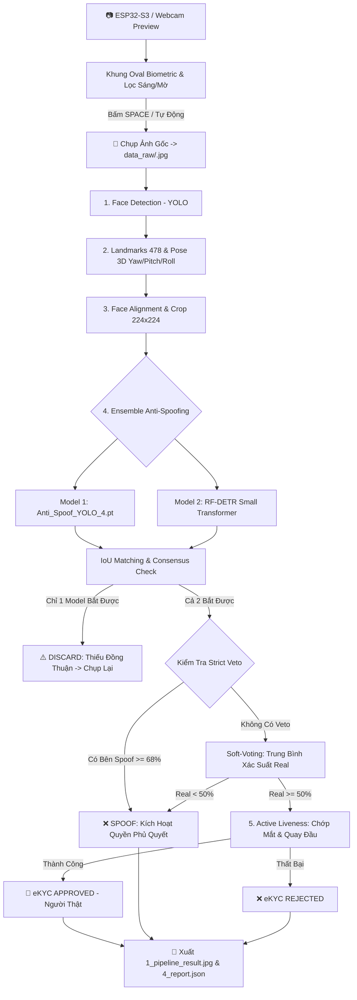

# 🛡️ Face-Project: Hệ Thống eKYC Face ID - Anti-Spoofing & Liveness Detection Pipeline

<p align="center">
  
  
  
  
  
  
  <a href="https://github.com/GiantKy/Face_project/actions/workflows/ci.yml">
    
  </a>
  <a href="https://gitlab.com/giaky0909/face_project_1/-/pipelines">
    
  </a>
</p>

Hệ thống nhận diện danh tính và xác thực sinh trắc học khuôn mặt chuẩn Ngân hàng / FinTech (eKYC). Tích hợp chuỗi xử lý khép kín từ phát hiện khuôn mặt, trích xuất 478 điểm mốc, ước lượng tư thế 3D, căn chỉnh hình học, **phát hiện giả mạo khuôn mặt đa tầng kết hợp Ensemble (YOLO_4 + RF-DETR Small Transformer)**, đến xác thực cử động sống chủ động (Active Liveness Challenge).

Dự án cung cấp cả **giao diện tương tác Webcam trực quan** lẫn **Headless Server Module** độc lập không phụ thuộc phần cứng (phục vụ kết nối thiết bị biên IoT / ESP32-S3), hỗ trợ CI/CD kiểm thử tự động trên **GitHub Actions** và **GitLab CI**.

---

## 📑 Mục Lục
1. [Link Tải Tất Cả Mô Hình AI (Google Drive)](#-link-tải-tất-cả-mô-hình-ai-google-drive)
2. [Tính Năng Nổi Bật](#-tính-năng-nổi-bật)
3. [Sơ Đồ Luồng Hoạt Động (Pipeline Workflow)](#-sơ-đồ-luồng-hoạt-động-pipeline-workflow)
4. [Cấu Trúc Thư Mục Dự Án](#-cấu-trúc-thư-mục-dự-án)
5. [Yêu Cầu & Cài Đặt Môi Trường](#-yêu-cầu--cài-đặt-môi-trường)
6. [Chi Tiết Kiến Trúc Ensemble (YOLO_4 + RF-DETR Small)](#-chi-tiết-kiến-trúc-ensemble-yolo_4--rf-detr-small)
7. [Hệ Thống Trực Quan 2 Window (Dual-Window & Side-by-Side)](#-hệ-thống-trực-quan-2-window-dual-window--side-by-side)
8. [Hướng Dẫn Sử Dụng & Kiểm Thử](#-hướng-dẫn-sử-dụng--kiểm-thử)
   - [Pipeline Hoàn Chỉnh Ensemble Mới Nhất](#1-chạy-quy-trình-ekyc-ensemble-mới-nhất-yolo_4--rf-detr-small)
   - [Kiểm Thử Server Module (Headless)](#2-kiểm-thử-server-module-headless-chế-độ-chuẩn-máy-chủ)
   - [Công Cụ Xem Kết Quả 2 Cửa Sổ](#3-công-cụ-xem-kết-quả-2-window-toolsview_resultspy)
   - [Kiểm Thử Từng Model Anti-Spoof](#4-kiểm-thử-từng-model-anti-spoof)
9. [Tích Hợp Server Module & Kết Nối Thiết Bị Biên (ESP32-S3)](#-tích-hợp-server-module--kết-nối-thiết-bị-biên-esp32-s3)
10. [Bảng Phím Tắt Điều Khiển (Hotkeys)](#-bảng-phím-tắt-điều-khiển-hotkeys)
11. [Khắc Phục Sự Cố Thường Gặp (Troubleshooting)](#-khắc-phục-sự-cố-thường-gặp-troubleshooting)

---

## 📦 Link Tải Tất Cả Mô Hình AI (Google Drive)

Toàn bộ trọng số mô hình đã được huấn luyện và tối ưu được lưu trữ tại Google Drive:

* 🔗 **Google Drive Repository:** [Google Drive - Face Project Models Folder](https://drive.google.com/drive/folders/1O7lqzhpJ8DE9x2AFzMyrd3M2-8sNdYBn) *(Thư mục lưu trữ toàn bộ weights: YOLO_1 đến YOLO_4, Face Detection, RF-DETR ONNX, MiniFASNet, MobileNetV2)*.

### Danh mục các file trong thư mục `models/`:
| Tên File Model | Kiến trúc / Nguồn | Kích thước | Chức năng chính |
|:---|:---|:---:|:---|
| `Face_Detection.pt` | YOLO Face Detection | ~19 MB | Phát hiện vị trí khuôn mặt tốc độ cao |
| `face_landmarker.task` | Google MediaPipe Tasks | ~3.7 MB | Trích xuất 478 điểm mốc 3D khuôn mặt |
| `Anti_Spoof_YOLO_4.pt` | YOLOv8 Custom Face Anti-Spoof | ~6.2 MB | Phân loại Real vs Spoof (v4 tối ưu nhất) |
| `Anti_Spoof_YOLO.pt` / `_1.pt`, `_2.pt`, `_3.pt` | YOLOv8 Checkpoints | 6 MB - 24 MB | Các phiên bản checkpoint huấn luyện trước |
| `models/roboflow/**/weights.onnx` | RF-DETR Small (Roboflow Transformer) | ~108.9 MB | Trích xuất đặc trưng sâu, vân màn hình/giấy in |
| `Anti_Spoof_minifasnet.pth` | MiniFASNetV2 PyTorch | ~240 KB | CNN siêu nhẹ chống giả mạo trên crop mặt |
| `2.7_80x80_MiniFASNetV2.pth` | MiniFASNetV2 Official | ~1.8 MB | Model chính thức nhận diện đa quy mô |
| `4_0_0_80x80_MiniFASNetV1SE.pth` | MiniFASNetV1SE Official | ~1.8 MB | Model phụ trợ tính năng Squeeze-and-Excitation |
| `Model_MobilenetV2/model.safetensors` | MobileNetV2 Safetensors | ~9 MB | Phân loại Real/Spoof trên crop 224x224 |

> [!NOTE]
> Sau khi tải về từ Google Drive, hãy giải nén và đặt các file vào thư mục `models/` của project theo đúng cấu trúc thư mục.

---

## 🌟 Tính Năng Nổi Bật

- **Lõi Ensemble 2 Model Độc Lập (YOLO_4 + RF-DETR Small):**
  - Kết hợp sức mạnh nhận diện siêu nhanh của **CNN/YOLOv8** và khả năng trích xuất vân ảnh sâu của **Detection Transformer (RF-DETR Small)**.
  - **IoU Bounding Box Matching ($\ge 0.40$):** Đảm bảo cả 2 mô hình cùng xác thực trên cùng một vị trí khuôn mặt.
  - **Cơ chế Strict Spoof Veto ($\ge 68\%$):** Khi một trong hai model phát hiện dấu hiệu giả mạo với độ tự tin $\ge 68\%$, hệ thống lập tức phủ quyết (Veto) thành **SPOOF** để bảo vệ an ninh tuyệt đối.
  - **Consensus Filtering (Lược bỏ ảnh khi thiếu đồng thuận):** Khi chỉ có duy nhất 1 model phát hiện được khuôn mặt (model còn lại `N/A`), hệ thống tự động loại bỏ ảnh (`DISCARD_NO_CONSENSUS`) và yêu cầu chụp lại thay vì phán đoán bừa.
- **Bộ Lọc Chất Lượng Ảnh (OpenCV Quality Filter):**
  - Kiểm tra độ sắc nét bằng phương sai Laplacian (`Var >= 70`) loại bỏ ảnh rung/nhòe.
  - Kiểm tra độ sáng kênh V trong HSV (`55 <= Luminance <= 225`) chống ảnh quá tối hoặc lóa đèn.
- **Khung Oval Biometric Ticks & Gaussian Blur Bokeh:**
  - Khung elip định vị khuôn mặt chuẩn eKYC, làm mờ ngoại vi giúp thuật toán chỉ tập trung vào người trong Oval và loại bỏ người xung quanh.
- **Xác Thực Cử Động Sống Động (Active Liveness):**
  - Đo tỉ lệ co giãn mí mắt (**Blink EAR**) để kiểm tra chớp mắt tự nhiên.
  - Đưa ra thử thách quay đầu ngẫu nhiên (**Head Movement Challenge**) với góc Euler Yaw/Pitch/Roll 3D.
- **Giao Diện Side-by-Side Dashboard Dark Theme:** Tách rời ảnh mặt sạch và bảng kết quả thông số kỹ thuật, xuất báo cáo JSON/CSV tự động.

---

## 🔄 Sơ Đồ Luồng Hoạt Động (Pipeline Workflow)



---

## 📁 Cấu Trúc Thư Mục Dự Án

```
Face-Project/
├── models/                     # Thư mục chứa trọng số AI (Tải từ Google Drive)
│   ├── Anti_Spoof_YOLO_4.pt    # Model YOLOv4 Face Anti-Spoof
│   ├── Face_Detection.pt       # Model YOLO Face Detection
│   ├── face_landmarker.task    # Google MediaPipe 478 Landmarks
│   ├── Anti_Spoof_minifasnet.pth
│   └── roboflow/               # Trọng số RF-DETR Small ONNX
│       └── face-spoof-detection-liika-owgrl-1-rfdetr-small-t1/
│           ├── class_names.txt
│           ├── environment.json
│           ├── model_type.json
│           └── weights.onnx    # RF-DETR Transformer ONNX (~109MB)
├── data_raw/                   # Lưu ảnh gốc chụp từ Webcam / ESP32-S3
├── server_module/              # Module AI Headless triển khai trên Server Backend
│   ├── pipeline.py
│   └── utils.py
├── src/                        # Thư viện thuật toán cốt lõi
│   ├── anti_spoof/             # MobileNetV2 & MiniFASNet
│   ├── face_alignment_crop/    # Affine transform & crop
│   ├── face_detection/         # YOLO Face Detector
│   ├── head_movement/          # Active Liveness quay đầu
│   ├── illumination/           # Đo sáng & CLAHE tiền xử lý
│   ├── landmark_detection/     # MediaPipe Face Landmarker
│   └── pose_validation/        # 3D Euler angle estimation
├── tests/                      # Kịch bản kiểm thử
│   ├── test_pipeline_ensemble_full.py  # ⭐ Pipeline eKYC hoàn chỉnh mới nhất
│   ├── test_ensemble_yolo_rfdetr.py    # Test độc lập Ensemble 2 model
│   ├── test_pipeline_full.py           # Pipeline eKYC YOLO đơn lẻ
│   ├── test_anti_spoof.py              # Test YOLO Anti-Spoof
│   ├── test_anti_spoof_rfdetr_small.py # Test RF-DETR Small
│   └── output/                 # Thư mục lưu kết quả xuất ra theo từng ID
├── tools/                      # Script hỗ trợ download và view kết quả
├── requirements.txt            # Danh sách dependencies
└── README.md
```

---

## ⚙️ Yêu Cầu & Cài Đặt Môi Trường

Khuyến nghị sử dụng **Python 3.10 hoặc 3.11** trên Windows / Linux.

```bash
# 1. Tạo môi trường ảo
python -m venv venv

# 2. Kích hoạt môi trường (Windows PowerShell)
venv\Scripts\Activate.ps1

# 3. Nâng cấp pip và cài đặt thư viện
python -m pip install --upgrade pip
pip install -r requirements.txt
```

---

## 🧠 Chi Tiết Kiến Trúc Ensemble (YOLO_4 + RF-DETR Small)

Hệ thống giải quyết triệt để điểm yếu của các giải pháp nhận diện đơn lẻ:

1. **Khớp nối Bounding Box (IoU Matching):**
   * Tính $\text{IoU} = \frac{\text{Area}(\text{Box}_{YOLO} \cap \text{Box}_{RFDETR})}{\text{Area}(\text{Box}_{YOLO} \cup \text{Box}_{RFDETR})}$.
   * Nếu $\text{IoU} \ge 0.40$: Xác nhận cả hai mô hình đang cùng thẩm định một khuôn mặt.
2. **Quy tắc Phủ Quyết An Ninh (Strict Spoof Veto):**
   * Nếu bất kỳ model nào có $\text{Conf}_{\text{SPOOF}} \ge 0.68$: Lập tức **phủ quyết** toàn bộ kết quả, hủy bỏ việc tính trung bình và đánh dấu là **SPOOF** ngay lập tức.
3. **Quy tắc Đồng Thuận (Consensus Rule):**
   * Nếu chỉ có 1 model phát hiện (ví dụ YOLO bắt được nhưng RF-DETR là `N/A`), hệ thống coi đây là sai số camera/nhiễu góc chụp $\rightarrow$ **Lược bỏ ảnh (`DISCARD_NO_CONSENSUS`)**, tuyệt đối không đoán mò.

---

## 🚀 Hướng Dẫn Sử Dụng & Kiểm Thử

### 1. Chạy Quy Trình eKYC Ensemble Mới Nhất (YOLO_4 + RF-DETR Small)

* **Chạy đầy đủ (Webcam + Chụp ảnh + AI Ensemble + Active Liveness):**
  ```bash
  python tests/test_pipeline_ensemble_full.py --cam 0
  ```
* **Chạy chế độ chụp nhanh (Chụp là có kết quả Ensemble ngay, bỏ qua Liveness):**
  ```bash
  python tests/test_pipeline_ensemble_full.py --cam 0 --static
  ```

### 2. Kiểm Thử Độc Lập Ensemble 2 Model (Snapshot & OpenCV Quality Filter)

* **Test trên Webcam:**
  ```bash
  python tests/test_ensemble_yolo_rfdetr.py --cam 0
  ```
* **Test trên 1 ảnh tĩnh bất kỳ:**
  ```bash
  python tests/test_ensemble_yolo_rfdetr.py --image data_raw/0.jpg
  ```

### 3. Công Cụ Xem Kết Quả 2 Cửa Sổ (`tools/view_results.py`)

Sau khi chạy xong, xem lại toàn bộ lịch sử các phiên eKYC đã lưu trong `output/`:
```bash
python tools/view_results.py
```

---

## 📡 Tích Hợp Server Module & Kết Nối Thiết Bị Biên (ESP32-S3)

Khi kết nối với vi điều khiển ESP32-S3 / ESP-CAM:
1. **ESP32-S3** chụp chùm 3-5 frame và thực hiện lọc thô độ nét Laplacian variance trước khi gửi.
2. ESP32-S3 truyền ảnh JPEG qua HTTP POST `/api/verify` hoặc WebSocket lên Server.
3. Server gọi hàm xử lý Headless trong `server_module/pipeline.py`:
   ```python
   from server_module import run_ekyc_pipeline
   
   # Nhận mảng bytes hoặc ảnh numpy từ ESP32-S3
   result = run_ekyc_pipeline(image_bytes)
   print("Kết quả:", result["final_verdict"])
   ```

---

## ⌨️ Bảng Phím Tắt Điều Khiển (Hotkeys)

| Phím Tắt | Chức Năng |
|:---:|:---|
| **SPACE** hoặc **c** | Chụp ảnh và chạy Full quy trình eKYC (AI + Active Liveness) |
| **s** | **Chụp nhanh & Lưu ngay** (Chạy Ensemble AI -> Xuất báo cáo không cần đợi Liveness) |
| **a** | Bật / Tắt chế độ tự động chụp khi khuôn mặt đạt chuẩn trong Oval |
| **r** | Khởi tạo phiên eKYC mới (ảnh tiếp theo) |
| **q** hoặc **ESC** | Thoát chương trình |

---

## 🛠️ Khắc Phục Sự Cố Thường Gặp (Troubleshooting)

1. **Lỗi `DISCARD_NO_CONSENSUS` (Chỉ 1 model nhận diện):**
   * *Nguyên nhân:* Khuôn mặt bị quay quá nghiêng hoặc ánh sáng phòng quá gắt làm 1 trong 2 model bị mất dấu.
   * *Khắc phục:* Canh chỉnh khuôn mặt ngay ngắn vào giữa khung Oval và chụp lại.
2. **Kích hoạt nhầm VETO `SPOOF (95%)` trên mặt thật:**
   * *Nguyên nhân:* Ánh sáng đèn LED chiếu thẳng làm lóa bóng vùng trán (giống phản chiếu màn hình điện thoại) hoặc camera tự động làm mịn da.
   * *Khắc phục:* Giảm bớt đèn rọi trực diện hoặc tắt tính năng làm đẹp (beauty filter) trên webcam.
