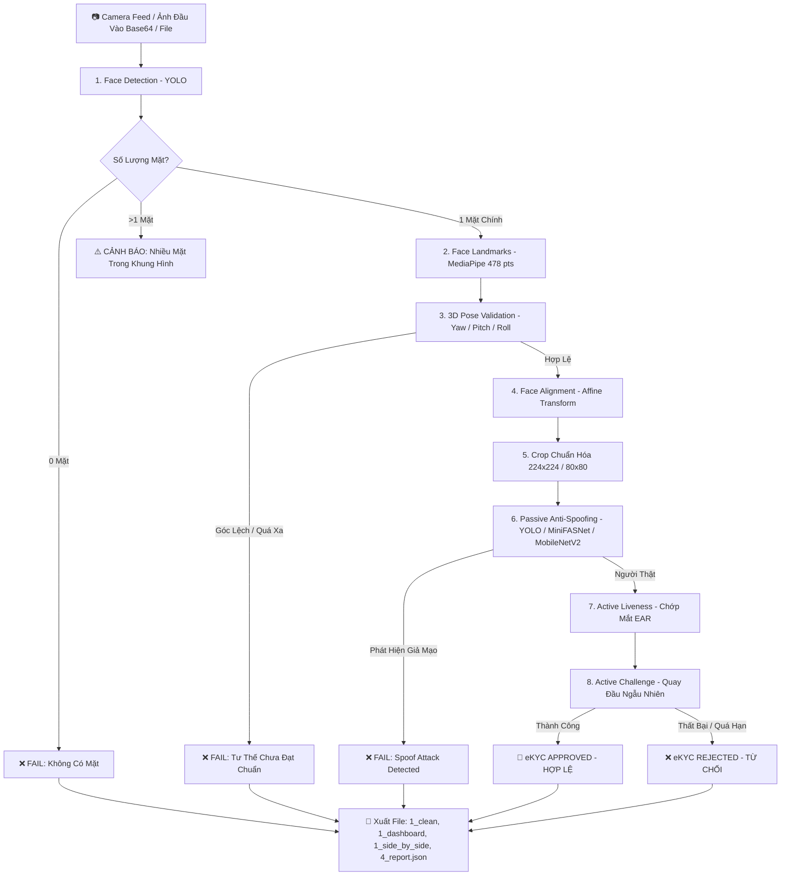

# 🛡️ Face-Project: Hệ Thống eKYC Face ID - Anti-Spoofing & Liveness Detection Pipeline

<p align="center">
  
  
  
  
  
  <a href="https://github.com/GiantKy/Face_project/actions/workflows/ci.yml">
    
  </a>
  <a href="https://gitlab.com/giaky0909/face_project_1/-/pipelines">
    
  </a>
</p>

Hệ thống nhận diện danh tính và xác thực sinh trắc học khuôn mặt chuẩn Ngân hàng / FinTech (eKYC). Tích hợp chuỗi xử lý khép kín từ phát hiện khuôn mặt, trích xuất 478 điểm mốc, ước lượng tư thế 3D, căn chỉnh hình học, phát hiện giả mạo khuôn mặt thụ động (Passive Anti-Spoofing), đến xác thực cử động sống chủ động (Active Liveness Challenge).

Dự án cung cấp cả **giao diện tương tác Webcam trực quan** lẫn **Headless Server Module** độc lập không phụ thuộc phần cứng, hỗ trợ CI/CD kiểm thử tự động trên **GitHub Actions** và **GitLab CI**.

---

## 📑 Mục Lục
1. [Tính Năng Nổi Bật](#-tính-năng-nổi-bật)
2. [Sơ Đồ Luồng Hoạt Động (Pipeline Workflow)](#-sơ-đồ-luồng-hoạt-động-pipeline-workflow)
3. [Cấu Trúc Thư Mục Dự Án](#-cấu-trúc-thư-mục-dự-án)
4. [Yêu Cầu & Cài Đặt Môi Trường](#-yêu-cầu--cài-đặt-môi-trường)
5. [Cấu Hình Mô Hình AI (Model Weights)](#-cấu-hình-mô-hình-ai-model-weights)
6. [Hệ Thống Trực Quan 2 Window (Dual-Window & Side-by-Side)](#-hệ-thống-trực-quan-2-window-dual-window--side-by-side)
7. [Hướng Dẫn Sử Dụng & Kiểm Thử](#-hướng-dẫn-sử-dụng--kiểm-thử)
   - [Kiểm Thử Server Module (Headless)](#1-kiểm-thử-server-module-headless-chế-độ-chuẩn-máy-chủ)
   - [Xem Kết Quả Bằng Tool 2 Cửa Sổ](#2-công-cụ-xem-kết-quả-2-window-toolsview_resultspy)
   - [Chạy Quy Trình eKYC Tương Tác Webcam Với MobileNetV2](#3-chạy-quy-trình-ekyc-tương-tác-webcam-với-mobilenetv2)
   - [Chạy Quy Trình eKYC Hoàn Chỉnh Với YOLO Anti-Spoof](#4-chạy-quy-trình-ekyc-hoàn-chỉnh-với-yolo-anti-spoof)
   - [Kiểm Thử Độc Lập Từng Thành Phần](#5-kiểm-thử-độc-lập-từng-thành-phần)
8. [Tích Hợp Server Module Vào Backend](#-tích-hợp-server-module-vào-backend)
9. [Quy Trình Tự Động Hóa CI/CD (GitHub Actions & GitLab CI)](#-quy-trình-tự-động-hóa-cicd-github-actions--gitlab-ci)
10. [Bảng Phím Tắt Điều Khiển (Hotkeys)](#-bảng-phím-tắt-điều-khiển-hotkeys)
11. [Hướng Dẫn Huấn Luyện Mô Hình (Model Training)](#-hướng-dẫn-huấn-luyện-mô-hình-model-training)
12. [Cấu Trúc Báo Cáo Đầu Ra (Output Reports)](#-cấu-trúc-báo-cáo-đầu-ra-output-reports)
13. [Khắc Phục Sự Cố Thường Gặp (Troubleshooting)](#-khắc-phục-sự-cố-thường-gặp-troubleshooting)

---

## 🌟 Tính Năng Nổi Bật

- **Phát hiện khuôn mặt tốc độ cao (Face Detection):** Tích hợp mô hình YOLO Face (`Face_Detection.pt`), phát hiện khuôn mặt thời gian thực cực nhanh và chính xác.
- **Trích xuất 478 điểm mốc khuôn mặt (Face Landmarks):** Ứng dụng Google MediaPipe Tasks API mới nhất, định vị chi tiết vùng mắt, sống mũi, khóe miệng và đường viền cằm.
- **Ước lượng tư thế 3D (3D Head Pose Estimation):** Thuật toán giải PnP (Perspective-n-Point) tính toán 3 góc Euler: **Yaw** (quay trái/phải), **Pitch** (ngước lên/cúi xuống), **Roll** (nghiêng đầu). Kiểm soát vị trí ngồi chuẩn, phát hiện quá xa/quá gần.
- **Căn chỉnh và chuẩn hóa hình học (Face Alignment & Crop):** Phép biến đổi Affine tự động xoay 2 đồng tử mắt về trục ngang chuẩn tắc và crop khuôn mặt chuẩn ($224 \times 224$ hoặc $80 \times 80$), triệt tiêu góc nghiêng giúp tăng vọt độ chính xác của AI.
- **Phát hiện giả mạo khuôn mặt đa tầng (Passive Anti-Spoofing):**
  - **YOLO Anti-Spoofing:** Quét trực tiếp toàn khung hình, phân loại Real vs Spoof (ảnh in giấy, màn hình điện thoại/máy tính, mặt nạ).
  - **MiniFASNetV2 / MiniFASNetV1SE:** Mạng nơ-ron tích chập gọn nhẹ, phát hiện vân màn hình và tương phản giả mạo.
  - **MobileNetV2 (Hugging Face / Safetensors):** Phân loại chuyên sâu khuôn mặt crop $224 \times 224$.
- **Xác thực cử động sống chủ động (Active Liveness Challenges):**
  - **Phát hiện chớp mắt tự nhiên:** Đo lường tỷ lệ co giãn mí mắt (Eye Aspect Ratio - EAR).
  - **Thử thách quay đầu ngẫu nhiên:** Hệ thống phát ngẫu nhiên lệnh chuyển động đầu (quay trái/phải) và kiểm tra người dùng trong thời gian thực.
- **Hệ thống hiển thị 2 Window tách rời (Dual-Window & Side-by-Side):**
  - Bảng thông số (HUD) không còn vẽ đè lên ảnh mặt.
  - Tách riêng **Cửa sổ 1: Ảnh khuôn mặt sạch** và **Cửa sổ 2: Bảng điều khiển Dashboard Dark Theme**.
  - Tự động xuất ảnh ghép song song xem được trên mọi trình xem ảnh.
- **Kiến trúc Headless Server Module:**
  - Thiết kế độc lập hoàn toàn, không gọi `cv2.VideoCapture()`, không mở GUI `cv2.imshow()`.
  - Nhận đầu vào đa dạng: Đường dẫn ảnh, chuỗi Base64, mảng Bytes, hoặc NumPy array.
  - Sẵn sàng bọc REST API (FastAPI/Flask) cho Microservices, Web, Mobile App và thiết bị MCU Edge (ESP32-CAM).
- **CI/CD Tự Động Hóa:** Thiết lập sẵn pipeline kiểm thử trên cả **GitHub Actions** và **GitLab CI**.

---

## 🔄 Sơ Đồ Luồng Hoạt Động (Pipeline Workflow)



---

## 📁 Cấu Trúc Thư Mục Dự Án

```
Face-Project/
│
├── .github/workflows/                    # CI/CD Pipelines cho GitHub Actions
│   └── ci.yml                            # Tự động kiểm thử server_module trên Ubuntu
├── .gitlab-ci.yml                        # CI/CD Pipelines cho GitLab
│
├── server_module/                        # 🧠 Headless Server Engine (Chuẩn Ngân hàng)
│   ├── __init__.py                       # Export các hàm public API
│   ├── config.py                         # Cấu hình đường dẫn model, ngưỡng nhận diện
│   ├── pipeline_server.py                # Class EKYCPipelineServer cốt lõi
│   ├── anti_spoof_yolo.py                # Bộ nhận diện YOLO Anti-Spoofing
│   ├── utils.py                          # Tiền xử lý ảnh, tính IoU, EAR, tạo Dashboard & ghép 2 window
│   ├── runner.py                         # Runner mẫu thực thi
│   ├── models/                           # Thư mục weights nội bộ của server_module
│   └── components/                       # Các module xử lý nội bộ độc lập
│       ├── face_detection/               # YOLO Face Detector
│       ├── landmark_detection/           # MediaPipe Face Landmarker
│       ├── pose_validation/              # 3D Head Pose Validator (SolvePnP)
│       ├── face_alignment_crop/          # Affine Transform Aligner & Crop
│       └── head_movement/                # Head Movement Challenge Detector
│
├── src/                                  # Mã nguồn module độc lập dùng chung
│   ├── face_detection/
│   ├── landmark_detection/
│   ├── pose_validation/
│   ├── face_alignment_crop/
│   ├── anti_spoof/                       # MiniFASNet & MobileNetV2
│   └── head_movement/
│
├── models/                               # Kho trọng số AI gốc (Weights)
│   ├── Face_Detection.pt                 # YOLO Face Detection (~19 MB)
│   ├── face_landmarker.task              # MediaPipe 478 Landmarks (~3.7 MB)
│   ├── Anti_Spoof_YOLO.pt                # YOLO Anti-Spoofing (~6.2 MB)
│   ├── 2.7_80x80_MiniFASNetV2.pth        # MiniFASNetV2 chính thống
│   ├── 4_0_0_80x80_MiniFASNetV1SE.pth    # MiniFASNetV1SE chính thống
│   └── Model_MobilenetV2/                # MobileNetV2 Safetensors
│
├── tools/                                # 🛠️ Công cụ hỗ trợ
│   └── view_results.py                   # Tool xem kết quả eKYC dạng 2 window tách rời
│
├── tests/                                # Kịch bản kiểm thử toàn diện
│   ├── test_server_module.py             # Kiểm thử Headless Server Module
│   ├── test_pipeline_full.py             # Pipeline eKYC tương tác v4
│   ├── test_pipeline_mobilenet.py        # Pipeline eKYC tích hợp MobileNetV2
│   ├── test_pipeline_ensemble.py         # Pipeline tích hợp Ensemble MiniFASNet
│   ├── test_face_detection.py
│   ├── test_landmark_detection.py
│   ├── test_pose_validation.py
│   ├── test_face_alignment_crop.py
│   ├── test_anti_spoof.py
│   └── test_head_movement.py
│
├── data_raw/                             # Lưu ảnh chụp đối soát (0.jpg, ...)
├── output/                               # Chứa kết quả xử lý và báo cáo định danh
├── train_code/                           # Huấn luyện mô hình (MiniFASNetV2, MobileNetV2)
│   ├── train_minifasnetv2.py
│   └── trainMobileNet.py
├── requirements.txt                      # Danh sách thư viện phụ thuộc
├── TEST_NOTES.md                         # Sổ tay ghi chép chi tiết kết quả test
└── README.md                             # Tài liệu dự án
```

---

## 💻 Yêu Cầu & Cài Đặt Môi Trường

### 1. Yêu Cầu Hệ Thống
- **Hệ điều hành:** Windows 10/11, Ubuntu 20.04+, hoặc macOS.
- **Python:** Khuyến nghị **Python 3.10** hoặc **3.11**.
- **Webcam:** Tích hợp sẵn hoặc USB Webcam (đối với chế độ tương tác trực tiếp).
- **Phần cứng:** Tối thiểu 8GB RAM. Có GPU NVIDIA CUDA là lợi thế (hệ thống tự động chạy CPU mượt mà nếu không có GPU).

### 2. Các Bước Cài Đặt

#### Bước 1: Khởi tạo môi trường ảo (Virtual Environment)
```bash
# Tạo môi trường ảo
python -m venv venv

# Kích hoạt trên Windows PowerShell:
venv\Scripts\Activate.ps1

# (Hoặc kích hoạt trên Linux / macOS / Git Bash):
source venv/bin/activate
```

#### Bước 2: Cài đặt PyTorch phù hợp với phần cứng
- **Nếu máy có GPU NVIDIA (Hỗ trợ CUDA 12.x):**
  ```bash
  pip install torch torchvision --index-url https://download.pytorch.org/whl/cu121
  ```
- **Nếu máy chạy thuần CPU:**
  ```bash
  pip install torch torchvision --index-url https://download.pytorch.org/whl/cpu
  ```

#### Bước 3: Cài đặt toàn bộ các thư viện phụ thuộc
```bash
pip install -r requirements.txt
```

> [!NOTE]
> Trên môi trường Linux (Ubuntu/Debian server hoặc Docker), cần cài thêm 4 gói đồ họa hệ thống cho OpenCV và MediaPipe:
> `sudo apt-get install -y libgl1 libglib2.0-0 libegl1 libgles2`

---

## 🧠 Cấu Hình Mô Hình AI (Model Weights)

Hệ thống sử dụng cơ chế tìm kiếm model thông minh: tự động quét trong `server_module/models/` và fallback sang `models/`:

| Tên File Model | Kích Thước | Thuật Toán | Mục Đích Sử Dụng |
|---|---|---|---|
| `Face_Detection.pt` | ~19.1 MB | YOLOv8 / YOLO | Phát hiện khuôn mặt trong khung hình |
| `face_landmarker.task` | ~3.7 MB | MediaPipe Tasks | Trích xuất 478 điểm mốc khuôn mặt 3D |
| `Anti_Spoof_YOLO.pt` | ~6.2 MB | YOLOv8 / YOLO | Nhận diện Real/Spoof trực tiếp qua Bounding Box |
| `2.7_80x80_MiniFASNetV2.pth` | ~1.2 MB | PyTorch MiniFASNet | Anti-Spoof crop tỉ lệ 2.7 ($80 \times 80$) |
| `4_0_0_80x80_MiniFASNetV1SE.pth`| ~1.2 MB | PyTorch MiniFASNet | Anti-Spoof crop tỉ lệ 4.0 ($80 \times 80$) |
| `Model_MobilenetV2/` | ~14 MB | Transformers Safetensors | Phân loại chống giả mạo khuôn mặt $224 \times 224$ |

---

## 🖥️ Hệ Thống Trực Quan 2 Window (Dual-Window & Side-by-Side)

Để giải quyết triệt để vấn đề vẽ bảng HUD đè lên ảnh làm che khuất khuôn mặt, hệ thống áp dụng kiến trúc hiển thị độc lập:

```
┌──────────────────────────────────────┐     ┌──────────────────────────────────────┐
│  WINDOW 1: KHUÔN MẶT SẠCH (Face View)│     │ WINDOW 2: BẢNG ĐIỀU KHIỂN (Dashboard)│
│                                      │     │                                      │
│   +------------------------------+   │     │  [E-KYC VERIFICATION DASHBOARD]      │
│   |        [ eKYC: APPROVED ]    |   │     │  Session: test_0                     │
│   |                              |   │     │  ----------------------------------  │
│   |         (  o  )   (  o  )    |   │     │  1. FACE DETECTION: PASS (98.5%)     │
│   |               /\             |   │     │  2. 3D POSE: PASS (Y:+2° P:+4° R:-1°)│
│   |              \__/            |   │     │  3. ANTI-SPOOF: REAL (92.4%)         │
│   |                              |   │     │     [████████████████░░] Real/Fake   │
│   +------------------------------+   │     │  4. ACTIVE LIVENESS: PASS (Blink/Turn)│
│   (BBox + Landmarks mảnh, không che) │     │  5. FINAL VERDICT: APPROVED (HỢP LỆ) │
└──────────────────────────────────────┘     └──────────────────────────────────────┘
```

Mỗi phiên định danh xuất ra **3 định dạng ảnh chuyên biệt** trong `output/<session_id>/`:
1. **`1_pipeline_result_clean.jpg`**: Ảnh khuôn mặt rõ nét kèm bounding box và landmarks thanh mảnh, góc phải có badge kết quả nhỏ, không bị bảng to che.
2. **`1_dashboard_panel.jpg`**: Bảng điều khiển thông số kỹ thuật sắc nét trên nền Dark Glassmorphism độc lập.
3. **`1_pipeline_side_by_side.jpg`** *(cũng là `1_pipeline_result.jpg`)*: Ảnh ghép đôi 2 window đặt song song cạnh nhau, mở bằng bất kỳ trình xem ảnh mặc định nào (Windows Photos) cũng xem trọn vẹn cả 2 cột mà không bị đè lên mặt.

---

## 🚀 Hướng Dẫn Sử Dụng & Kiểm Thử

### 1. Kiểm Thử Server Module (Headless - Chế độ chuẩn máy chủ)
Kiểm tra luồng xử lý eKYC toàn diện trên ảnh tĩnh (không cần webcam):
```bash
python tests/test_server_module.py
```
*Tùy chọn mở 2 cửa sổ trực quan xem ngay sau khi test:*
```bash
python tests/test_server_module.py --view
```

---

### 2. Công Cụ Xem Kết Quả 2 Window (`tools/view_results.py`)
Duyệt qua các session kết quả trong thư mục `output/` với 2 cửa sổ OpenCV tự động căn chỉnh cạnh nhau trên màn hình:
```bash
# Xem kết quả của một session cụ thể
python tools/view_results.py --dir output/test_server_module/test_0

# Quét và duyệt toàn bộ tất cả kết quả trong thư mục output/
python tools/view_results.py --all
```

**Phím tắt điều khiển trong viewer:**
- <kbd>→</kbd> hoặc <kbd>D</kbd>: Chuyển sang session kết quả tiếp theo.
- <kbd>←</kbd> hoặc <kbd>A</kbd>: Quay lại session kết quả trước đó.
- <kbd>M</kbd>: Chuyển đổi giữa chế độ **[2 Cửa Sổ Rời]** và **[1 Cửa Sổ Ghép Đôi]**.
- <kbd>C</kbd>: Bật/Tắt xem ảnh gốc (`0_raw_image.jpg`) vs ảnh annotated.
- <kbd>ESC</kbd> hoặc <kbd>Q</kbd>: Thoát viewer.

---

### 3. Chạy Quy Trình eKYC Tương Tác Webcam Với MobileNetV2
Ứng dụng tương tác trực tiếp qua camera với model MobileNetV2 Safetensors 224x224:
```bash
# Chạy webcam trực tiếp (Mặc định)
python tests/test_pipeline_mobilenet.py

# Bật chế độ tự động chụp khi căn mặt chuẩn (Auto-Capture)
python tests/test_pipeline_mobilenet.py --auto

# Chạy kiểm thử hàng loạt trên thư mục ảnh data_raw/
python tests/test_pipeline_mobilenet.py --batch
```

---

### 4. Chạy Quy Trình eKYC Hoàn Chỉnh Với YOLO Anti-Spoof
Quy trình eKYC tương tác cao cấp sử dụng YOLOv8 Anti-Spoofing:
```bash
python tests/test_pipeline_full.py
```
*Tùy chọn tham số:*
```bash
# Đổi chỉ số camera (Camera phụ index 1)
python tests/test_pipeline_full.py --camera 1

# Bật chế độ Auto-Capture
python tests/test_pipeline_full.py --auto

# Tùy chỉnh ngưỡng quyết định Real (mặc định 0.60)
python tests/test_pipeline_full.py --threshold 0.65
```

---

### 5. Kiểm Thử Độc Lập Từng Thành Phần
```bash
# 1. Phát hiện khuôn mặt
python tests/test_face_detection.py

# 2. Face Landmarks 478 điểm
python tests/test_landmark_detection.py

# 3. Ước lượng góc xoay đầu 3D Pose
python tests/test_pose_validation.py

# 4. Căn thẳng trục mắt & crop khuôn mặt
python tests/test_face_alignment_crop.py

# 5. Anti-Spoofing MiniFASNet
python tests/test_anti_spoof_minifasnet.py

# 6. Anti-Spoofing MobileNetV2
python tests/test_anti_spoof_mobilenetv2.py

# 7. Thử thách cử động đầu Active Liveness
python tests/test_head_movement.py
```

---

## 🔌 Tích Hợp Server Module Vào Backend

`server_module` có thể dễ dàng nhúng vào bất kỳ framework Backend nào (FastAPI, Flask, Django, gRPC, Celery worker):

```python
from server_module import EKYCPipelineServer, load_image

# 1. Khởi tạo Pipeline Server (tải trước các mô hình vào bộ nhớ)
server = EKYCPipelineServer()

# 2. Nhận ảnh từ request (file path, chuỗi Base64, bytes, hoặc numpy array)
img = load_image("data_raw/0.jpg")

# 3. Bước 1: Kiểm tra tư thế trước khi chụp (Real-time Pre-capture Check)
pose_result = server.validate_pose(img)
if not pose_result["is_valid"]:
    print(f"Hướng dẫn người dùng: {pose_result['guide']}")

# 4. Bước 2: Quét chống giả mạo Anti-Spoofing
spoof_result = server.check_antispoof(img)
print(f"Nhãn: {spoof_result['label']} | Tỉ lệ thật: {spoof_result['confidence']*100:.1f}%")

# 5. Bước 3: Xác thực eKYC tổng hợp và xuất báo cáo đối soát
report = server.full_verify(
    image_input=img,
    img_id="trans_12345",
    blink_passed=True,
    head_movement_passed=True,
    head_action_name="TURN_LEFT",
    output_dir="output/transactions",
    save_visuals=True
)

if report["final_decision"]["approved"]:
    print("✅ eKYC HỢP LỆ (APPROVED)")
else:
    print(f"❌ eKYC TỪ CHỐI (REJECTED): {report['final_decision']['reasons']}")
```

---

## ⚙️ Quy Trình Tự Động Hóa CI/CD (GitHub Actions & GitLab CI)

Dự án được cấu hình sẵn 2 pipeline kiểm thử tự động đạt chuẩn MLOps:

- **GitHub Actions ([`.github/workflows/ci.yml`](file:///c:/Users/HP/Desktop/Face-Project/.github/workflows/ci.yml))**:
  - Chạy trên máy ảo `ubuntu-latest`, Python 3.11.
  - Tự động cài đặt các thư viện đồ họa hệ thống (`libgl1`, `libglib2.0-0`, `libegl1`, `libgles2`).
  - Kiểm thử tự động `tests/test_server_module.py`.
  - Tự động lưu trữ artifact kết quả kiểm thử trong 7 ngày.
- **GitLab CI ([`.gitlab-ci.yml`](file:///c:/Users/HP/Desktop/Face-Project/.gitlab-ci.yml))**:
  - Chạy trên container `python:3.11-slim`.
  - Thiết lập pip cache (`.cache/pip`) tăng tốc build.
  - Tự động lưu báo cáo kiểm thử lên GitLab Artifacts.

---

## ⌨️ Bảng Phím Tắt Điều Khiển (Hotkeys)

Trong giao diện tương tác Webcam (`test_pipeline_full.py` / `test_pipeline_mobilenet.py`):

| Phím Tắt | Tác Vụ |
|:---:|:---|
| <kbd>SPACE</kbd> hoặc <kbd>C</kbd> | Chụp ảnh thủ công và bắt đầu luồng xác thực |
| <kbd>A</kbd> | Bật / Tắt chế độ **Auto-Capture** (tự động chụp khi mặt chuẩn 25 frames) |
| <kbd>R</kbd> | Đặt lại (Reset) hệ thống để bắt đầu phiên mới |
| <kbd>D</kbd> | Bật / Tắt hiển thị chi tiết mốc Landmarks và vector hướng mặt |
| <kbd>Q</kbd> hoặc <kbd>ESC</kbd> | Thoát chương trình |

---

## 🏋️ Hướng Dẫn Huấn Luyện Mô Hình (Model Training)

File `train_minifasnetv2.py` hỗ trợ huấn luyện mạng MiniFASNetV2 phân loại Real / Spoof trên máy cục bộ hoặc Google Colab GPU:

```bash
python train_code/train_minifasnetv2.py \
    --data_dir "./dataset" \
    --epochs 50 \
    --batch_size 64 \
    --lr 0.001 \
    --image_size 80 \
    --amp
```

**Kỹ thuật tối ưu tích hợp:**
- **Mixed Precision (AMP):** Tăng tốc huấn luyện trên GPU NVIDIA.
- **Label Smoothing:** Chống overfitting, làm mềm xác suất phân loại.
- **Class Weights:** Cân bằng trọng số dữ liệu Real/Spoof chênh lệch.
- **Export Checkpoint:** Xuất weights tương thích 100% với bộ nạp `src/anti_spoof/minifasnet.py`.

---

## 📊 Cấu Trúc Báo Cáo Đầu Ra (Output Reports)

Sau mỗi phiên eKYC hoàn tất, kết quả được xuất tự động trong thư mục `output/<id>/`:

```
output/
└── test_0/
    ├── 0_raw_image.jpg                 # Ảnh gốc đầu vào phục vụ đối soát
    ├── 1_pipeline_result_clean.jpg     # Ảnh mặt sạch, có BBox & Landmarks (không bị che)
    ├── 1_dashboard_panel.jpg           # Bảng thông số Dashboard độc lập độ phân giải cao
    ├── 1_pipeline_side_by_side.jpg     # Ảnh ghép 2 Window song song (Mặt | Dashboard)
    ├── 1_pipeline_result.jpg           # Ảnh kết quả mặc định (đồng bộ side-by-side)
    ├── 2_face_crop_224.jpg             # Khuôn mặt chính đã căn thẳng chuẩn 224x224
    ├── 3_aligned_full.jpg              # Ảnh toàn cảnh sau phép quay Affine thẳng trục mắt
    ├── 4_report.json                   # Báo cáo JSON chi tiết tất cả các chỉ số
    └── all_faces_cropped/              # Thư mục chứa từng khuôn mặt bị cắt lẻ
```

Đồng thời bảng nhật ký tổng hợp được tự động cập nhật:
- `output/batch_summary_v4.csv` (Mở trực tiếp bằng Microsoft Excel để thống kê).
- `output/batch_summary_v4.json`.

---

## 🛠️ Khắc Phục Sự Cố Thường Gặp (Troubleshooting)

### 1. Lỗi `OSError: libEGL.so.1` hoặc `libGLESv2.so.2: cannot open shared object file`
- **Nguyên nhân:** Khi chạy trên môi trường Linux headless (Ubuntu server, Docker, GitHub Actions, GitLab CI), MediaPipe Face Landmarker cần các thư viện đồ họa EGL và OpenGL ES.
- **Cách khắc phục:** Cài đặt 4 thư viện hệ thống:
  ```bash
  sudo apt-get update && sudo apt-get install -y libgl1 libglib2.0-0 libegl1 libgles2
  ```

### 2. Lỗi `ModuleNotFoundError: No module named 'cv2'`
- **Nguyên nhân:** Trên Windows có thể bị xung đột môi trường Python giữa MSYS2/Git Bash và Python chính thức.
- **Cách khắc phục:** Luôn kích hoạt môi trường ảo `venv\Scripts\activate` trước khi chạy hoặc dùng lệnh `py` của Windows Python Launcher:
  ```bash
  py tests/test_server_module.py
  ```

### 3. Lỗi không mở được Webcam (`cv2.VideoCapture`)
- Kiểm tra quyền truy cập Camera trong Windows Settings $\rightarrow$ Privacy $\rightarrow$ Camera.
- Tắt các ứng dụng đang chiếm quyền camera (Zoom, Teams, Camera app).
- Thử chuyển đổi camera index bằng tham số `--camera 1` hoặc `--camera 2`.

### 4. Xung đột phiên bản `numpy`
- Phiên bản NumPy 2.x có thể gây lỗi nhị phân với một số bản build OpenCV / MediaPipe cũ. Dự án đã cố định trong `requirements.txt`:
  ```bash
  pip install "numpy>=1.24.3,<2.0.0"
  ```

### 5. Tiếng Việt bị lỗi hiển thị font trên OpenCV
- Hàm `cv2.putText` thuần của OpenCV không hỗ trợ ký tự Unicode có dấu. Module `remove_vietnamese_accents()` trong `server_module/utils.py` đã tự động chuyển đổi sang không dấu chuẩn, đảm bảo hiển thị sắc nét trên mọi hệ điều hành.

---

## 📄 Bản Quyền & Giấy Phép (License)
Dự án được phát triển phục vụ mục đích nghiên cứu, học tập và ứng dụng định danh số an toàn (eKYC). Mọi đóng góp và cải tiến đều được hoan nghênh!
