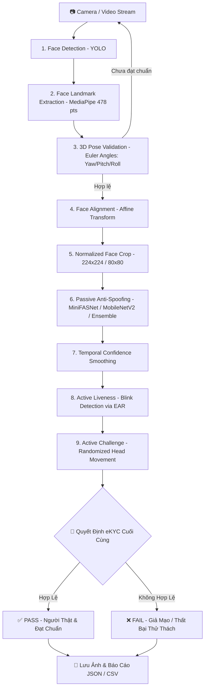

# 🛡️ Face-Project: Hệ Thống eKYC Face ID - Anti-Spoofing & Liveness Detection Pipeline

Hệ thống nhận diện danh tính và xác thực sinh trắc học khuôn mặt chuẩn Ngân hàng / FinTech (eKYC). Tích hợp chuỗi xử lý khép kín từ phát hiện khuôn mặt, chuẩn hóa góc nhìn, phát hiện giả mạo khuôn mặt thụ động (Passive Anti-Spoofing) bằng nhiều mô hình Deep Learning tiên tiến, đến xác thực cử động sống chủ động (Active Liveness Challenge).

---

## 📑 Mục Lục
1. [Tính Năng Nổi Bật](#-tính-năng-nổi-bật)
2. [Sơ Đồ Luồng Hoạt Động (Pipeline Workflow)](#-sơ-đồ-luồng-hoạt-động-pipeline-workflow)
3. [Cấu Trúc Thư Mục Dự Án](#-cấu-trúc-thư-mục-dự-án)
4. [Yêu Cầu & Cài Đặt Môi Trường](#-yêu-cầu--cài-đặt-môi-trường)
5. [Cấu Hình Model Weights](#-cấu-hình-model-weights)
6. [Hướng Dẫn Sử Dụng & Kiểm Thử](#-hướng-dẫn-sử-dụng--kiểm-thử)
   - [Chạy Demo Webcam Cơ Bản](#1-chạy-demo-webcam-cơ-bản)
   - [Chạy Quy Trình eKYC Với MobileNetV2 (Khuyên Dùng)](#2-chạy-quy-trình-ekyc-với-mobilenetv2-khuyên-dùng)
   - [Chạy Quy Trình eKYC Hoàn Chỉnh Với YOLOv8](#3-chạy-quy-trình-ekyc-hoàn-chỉnh-với-yolov8)
   - [Chạy Pipeline Ensemble Đa Mô Hình](#4-chạy-pipeline-ensemble-đa-mô-hình)
   - [Kiểm Thử Độc Lập Từng Module](#5-kiểm-thử-độc-lập-từng-module)
7. [Bảng Phím Tắt Điều Khiển (Hotkeys)](#-bảng-phím-tắt-điều-khiển-hotkeys)
8. [Hướng Dẫn Huấn Luyện Mô Hình (Model Training)](#-hướng-dẫn-huấn-luyện-mô-hình-model-training)
9. [Cấu Trúc Báo Cáo Đầu Ra (Output Reports)](#-cấu-trúc-báo-cáo-đầu-ra-output-reports)
10. [Khắc Phục Sự Cố Thường Gặp (Troubleshooting)](#-khắc-phục-sự-cố-thường-gặp-troubleshooting)

---

## 🌟 Tính Năng Nổi Bật

- **Phát hiện khuôn mặt tốc độ cao:** Tích hợp mô hình YOLO Face Detection (`Face_Detection.pt`), phát hiện khuôn mặt chính xác với FPS mượt mà.
- **Trích xuất 478 điểm mốc khuôn mặt (Face Landmarks):** Ứng dụng MediaPipe Face Landmarker Tasks API mới nhất, định vị chính xác vị trí mắt, sống mũi, miệng và đường viền khuôn mặt.
- **Ước lượng tư thế 3D (3D Head Pose Estimation):** Thuật toán giải PnP (Perspective-n-Point) tính toán chính xác 3 góc Euler: **Yaw** (quay trái/phải), **Pitch** (ngước lên/cúi xuống), **Roll** (nghiêng đầu), đảm bảo tư thế chụp đạt chuẩn quy định.
- **Căn chỉnh và chuẩn hóa khuôn mặt (Face Alignment & Crop):** Phép biến đổi Affine tự động xoay 2 đồng tử mắt về phương ngang và crop khuôn mặt về kích thước chuẩn ($224 \times 224$ hoặc $80 \times 80$), triệt tiêu góc nghiêng giúp tăng độ chính xác của AI.
- **Phát hiện giả mạo khuôn mặt đa tầng (Passive Anti-Spoofing):**
  - **MiniFASNetV2 / MiniFASNetV1SE:** Kiến trúc mạng nơ-ron tích chập siêu nhẹ, phát hiện các cuộc tấn công qua màn hình điện thoại/máy tính, ảnh in giấy (Replay Attack, Print Attack).
  - **MobileNetV2 (Hugging Face / Safetensors):** Tích hợp phân loại ảnh độ phân giải $224 \times 224$, tự động chọn checkpoint mới nhất.
  - **Ensemble đa mô hình:** Cơ chế kết hợp điểm trọng số giữa nhiều kiến trúc mạng (YOLOv7 + MiniFASNet hoặc Ensemble các phiên bản MiniFASNet) nhằm đạt tỷ lệ nhận diện sai (FAR/FRR) thấp nhất.
- **Làm mượt điểm số theo thời gian (Temporal Score Smoothing):** Loại bỏ hiện tượng nhảy điểm xác suất giữa các frame video liên tiếp.
- **Xác thực cử động sống chủ động (Active Liveness Challenges):**
  - **Phát hiện chớp mắt tự nhiên:** Đo lường tỷ lệ co giãn mí mắt (Eye Aspect Ratio - EAR).
  - **Thử thách quay đầu ngẫu nhiên:** Hệ thống phát sinh ngẫu nhiên các yêu cầu hành động (quay trái, quay phải) và kiểm tra người dùng trong giới hạn thời gian thực.
- **Hệ thống báo cáo tự động:** Tự động lưu ảnh gốc, ảnh đã căn chỉnh, ảnh crop và xuất file tổng kết chi tiết (`report.json`, `batch_summary_v4.csv`).

---

## 🔄 Sơ Đồ Luồng Hoạt Động (Pipeline Workflow)



---

## 📁 Cấu Trúc Thư Mục Dự Án

```
Face-Project/
│
├── src/                                  # Mã nguồn module chức năng
│   ├── face_detection/                   # Phát hiện khuôn mặt (YOLO Face)
│   │   ├── detector.py                   # Class FaceDetector tải model YOLO
│   │   └── face_crop.py                  # Hàm crop khuôn mặt từ Bounding Box
│   │
│   ├── landmark_detection/               # Trích xuất Face Landmarks
│   │   ├── landmark_detector.py          # Class LandmarkDetector (MediaPipe Tasks API)
│   │   ├── draw_landmarks.py             # Vẽ điểm mốc trực quan lên frame
│   │   ├── utils.py                      # Hàm trích xuất tọa độ điểm mốc (x, y, z)
│   │   └── config.py, constants.py       # Ngưỡng phát hiện và chỉ số các điểm đặc trưng
│   │
│   ├── pose_validation/                  # Kiểm tra tư thế đầu (Pose Estimation)
│   │   ├── head_pose_3d.py               # Giải PnP tính Euler Angles (Yaw, Pitch, Roll)
│   │   ├── validator.py                  # Class PoseValidator đánh giá góc nhìn chuẩn
│   │   └── draw_pose.py                  # Hiển thị vector hướng mặt và thông số góc
│   │
│   ├── face_alignment_crop/              # Căn thẳng mắt & cắt ảnh khuôn mặt chuẩn
│   │   └── face_align_crop.py            # Class FaceAligner (Affine Transform)
│   │
│   ├── anti_spoof/                       # Các mô hình chống giả mạo khuôn mặt
│   │   ├── minifasnet.py                 # Kiến trúc & Inference MiniFASNetV2 nội bộ
│   │   ├── minifasnet_official.py        # Kiến trúc MiniFASNetV1SE & V2 chính thống
│   │   └── mobilenetv2.py                # MobileNetV2 qua Transformers/Safetensors
│   │
│   └── head_movement/                    # Quản lý thử thách cử động đầu
│       └── head_movement_detector.py     # Class HeadMovementDetector & Challenge State
│
├── models/                               # Chứa các file trọng số AI (Weights)
│   ├── Face_Detection.pt                 # Trọng số YOLO phát hiện khuôn mặt
│   ├── face_landmarker.task              # Model MediaPipe Face Landmarker
│   ├── Anti_Spoof_YOLO.pt                # Trọng số YOLO Anti-Spoof
│   ├── 2.7_80x80_MiniFASNetV2.pth        # MiniFASNetV2 80x80 chính thống
│   ├── 4_0_0_80x80_MiniFASNetV1SE.pth    # MiniFASNetV1SE 80x80 chính thống
│   ├── Anti_Spoof_minifasnet.pth         # MiniFASNetV2 tự huấn luyện
│   └── Model_MobilenetV2/                # Thư mục model Hugging Face Safetensors
│
├── inference/                            # Chạy ứng dụng cơ bản
│   └── webcam.py                         # Demo nhận diện khuôn mặt qua webcam
│
├── tests/                                # Kịch bản kiểm thử chi tiết từng phần & toàn diện
│   ├── test_face_detection.py            # Kiểm thử module Face Detection
│   ├── test_landmark_detection.py        # Kiểm thử MediaPipe Landmarks
│   ├── test_pose_validation.py           # Kiểm thử tính góc 3D Pose
│   ├── test_face_alignment_crop.py       # Kiểm thử căn chỉnh & crop khuôn mặt
│   ├── test_anti_spoof.py                # Kiểm thử Anti-Spoof với YOLO
│   ├── test_anti_spoof_minifasnet.py     # Kiểm thử Anti-Spoof với MiniFASNet
│   ├── test_anti_spoof_mobilenetv2.py    # Kiểm thử Anti-Spoof với MobileNetV2
│   ├── test_anti_spoof_official_ensemble.py # Kiểm thử Ensemble đa mô hình MiniFASNet
│   ├── test_head_movement.py             # Kiểm thử thử thách cử động đầu
│   ├── test_pipeline.py                  # Pipeline v1: Detection + Anti-Spoof
│   ├── test_pipeline_2.py                # Pipeline v2: Thêm Alignment & Smoothing
│   ├── test_pipeline_3.py                # Pipeline v3: Thêm Blink Detection (EAR)
│   ├── test_pipeline_ensemble.py         # Pipeline tích hợp Ensemble MiniFASNet
│   ├── test_pipeline_mobilenet.py        # Pipeline tích hợp MobileNetV2 Anti-Spoof
│   └── test_pipeline_full.py             # Pipeline v4: Luồng eKYC hoàn chỉnh tương tác
│
├── data_raw/                             # Lưu ảnh chụp gốc phục vụ đối soát
├── output/                               # Chứa kết quả xử lý, ảnh crop và file báo cáo JSON
├── train_minifasnetv2.py                 # Script huấn luyện mô hình MiniFASNetV2
├── requirements.txt                      # Danh sách các thư viện phụ thuộc
├── TEST_NOTES.md                         # Sổ tay ghi chú chi tiết kết quả các bài test
└── README.md                             # Tài liệu hướng dẫn sử dụng dự án
```

---

## 💻 Yêu Cầu & Cài Đặt Môi Trường

### 1. Yêu Cầu Hệ Thống
- **Hệ điều hành:** Windows 10/11, Ubuntu 20.04+, hoặc macOS.
- **Python:** Khuyến nghị **Python 3.10** đến **3.12**.
- **Webcam:** Camera tích hợp hoặc USB Webcam hoạt động ổn định.
- **Phần cứng:** Tối thiểu 8GB RAM. Có GPU NVIDIA hỗ trợ CUDA để đạt FPS tối đa (chương trình vẫn tự động chạy CPU nếu không có GPU).

### 2. Các Bước Cài Đặt

#### Bước 1: Clone kho mã nguồn hoặc tải project về máy
```powershell
cd c:\Users\HP\Desktop\Face-Project
```

#### Bước 2: Khởi tạo môi trường ảo (Virtual Environment)
```powershell
# Tạo môi trường ảo tên 'venv'
python -m venv venv

# Kích hoạt môi trường trên Windows (PowerShell)
venv\Scripts\Activate.ps1

# (Nếu dùng Command Prompt cmd.exe)
# venv\Scripts\activate.bat
```

> [!TIP]
> Nếu gặp lỗi chính sách thực thi script trên Windows PowerShell (`Execution_Policies`), hãy mở PowerShell dưới quyền Administrator và chạy lệnh:
> `Set-ExecutionPolicy -ExecutionPolicy RemoteSigned -Scope CurrentUser`

#### Bước 3: Cài đặt PyTorch phù hợp với phần cứng

- **Nếu máy có GPU NVIDIA (Hỗ trợ CUDA 11.8 hoặc 12.x):**
  ```powershell
  # Cài bản CUDA 12.1 (khuyên dùng)
  pip install torch torchvision --index-url https://download.pytorch.org/whl/cu121
  ```
- **Nếu máy chỉ dùng CPU:**
  ```powershell
  pip install torch torchvision --index-url https://download.pytorch.org/whl/cpu
  ```

#### Bước 4: Cài đặt toàn bộ các thư viện còn lại
```powershell
pip install -r requirements.txt
```

---

## 🧠 Cấu Hình Model Weights

Tất cả trọng số mô hình được đặt trong thư mục `models/`. Hãy đảm bảo các file sau đã sẵn sàng:

| Tên File Model | Thuật Toán / Framework | Mục Đích Sử Dụng |
|---|---|---|
| `Face_Detection.pt` | YOLOv8 / YOLO | Phát hiện khuôn mặt trong khung hình |
| `face_landmarker.task` | MediaPipe Tasks | Trích xuất 478 điểm mốc khuôn mặt 3D |
| `Anti_Spoof_YOLO.pt` | YOLOv8 / YOLO | Nhận diện Real/Spoof trực tiếp qua Bounding Box |
| `2.7_80x80_MiniFASNetV2.pth` | PyTorch MiniFASNet | Model Anti-Spoof chính thống tỉ lệ crop 2.7 ($80 \times 80$) |
| `4_0_0_80x80_MiniFASNetV1SE.pth`| PyTorch MiniFASNet | Model Anti-Spoof chính thống tỉ lệ crop 4.0 ($80 \times 80$) |
| `Anti_Spoof_minifasnet.pth` | PyTorch MiniFASNet | Model MiniFASNetV2 tự train phân loại Real/Spoof ($80 \times 80$) |
| `Model_MobilenetV2/` | Transformers / Safetensors | Model MobileNetV2 Anti-Spoof input $224 \times 224$ |

---

## 🚀 Hướng Dẫn Sử Dụng & Kiểm Thử

> [!TIP]
> Trên hệ điều hành Windows, hãy sử dụng lệnh **`py`** thay vì `python` để đảm bảo thực thi đúng môi trường Python 3.11 chính thức (đã có đủ OpenCV, PyTorch, MediaPipe và Transformers).

### 1. Chạy Demo Webcam Cơ Bản
Kiểm tra camera và khả năng nhận diện khuôn mặt qua YOLO:
```powershell
py inference/webcam.py
```
*Nhấn phím `ESC` để thoát.*

---

### 2. Chạy Quy Trình eKYC Với MobileNetV2 (Khuyên Dùng)
Quy trình eKYC tương tác hoàn chỉnh tích hợp mô hình MobileNetV2 Safetensors 224x224, ngưỡng quyết định Real mặc định **0.6**:
```powershell
# Chạy tương tác Webcam trực tiếp (Mặc định)
py tests/test_pipeline_mobilenet.py

# Bật chế độ tự động chụp khi căn mặt đạt chuẩn
py tests/test_pipeline_mobilenet.py --auto

# Chạy kiểm thử hàng loạt trên thư mục ảnh data_raw/
py tests/test_pipeline_mobilenet.py --batch

# Chụp nhanh lưu kết quả (bỏ qua bước Active Liveness)
py tests/test_pipeline_mobilenet.py --static
```

---

### 3. Chạy Quy Trình eKYC Hoàn Chỉnh Với YOLOv8
Chương trình tương tác trực quan cao cấp, thực hiện trọn vẹn luồng eKYC với YOLO Anti-Spoofing:
```powershell
py tests/test_pipeline_full.py
```

**Các tham số tùy chọn mở rộng:**
```powershell
# Chạy với camera phụ (Camera index 1)
py tests/test_pipeline_full.py --camera 1

# Bật chế độ tự động chụp khi mặt đúng vị trí chuẩn
py tests/test_pipeline_full.py --auto

# Tùy chỉnh ngưỡng quyết định Real/Spoof (mặc định 0.6)
py tests/test_pipeline_full.py --threshold 0.65
```

---

### 4. Chạy Pipeline Ensemble Đa Mô Hình
Tích hợp đồng thời nhiều model MiniFASNet (V2 + V1SE) để chống giả mạo chính xác cao:
```powershell
py tests/test_pipeline_ensemble.py
```

---

### 5. Kiểm Thử Độc Lập Từng Module

Bạn có thể chạy kiểm thử riêng biệt từng thành phần chức năng:

```powershell
# 1. Kiểm tra phát hiện khuôn mặt
py tests/test_face_detection.py

# 2. Kiểm tra Face Landmark 478 điểm
py tests/test_landmark_detection.py

# 3. Kiểm tra tính toán góc 3D Pose (Yaw, Pitch, Roll)
py tests/test_pose_validation.py

# 4. Kiểm tra căn thẳng khuôn mặt & crop chuẩn 224x224
py tests/test_face_alignment_crop.py

# 5. Kiểm tra Anti-Spoofing với MiniFASNet
py tests/test_anti_spoof_minifasnet.py

# 6. Kiểm tra Anti-Spoofing với MobileNetV2 (Hugging Face)
py tests/test_anti_spoof_mobilenetv2.py

# 7. Kiểm tra thử thách cử động đầu Active Liveness
py tests/test_head_movement.py
```

> [!NOTE]
> Chi tiết tiêu chí đánh giá và bảng đối chiếu kết quả của toàn bộ 15 bài test xem tại [TEST_NOTES.md](file:///c:/Users/HP/Desktop/Face-Project/TEST_NOTES.md).

---

## ⌨️ Bảng Phím Tắt Điều Khiển (Hotkeys)

Trong giao diện tương tác eKYC (`test_pipeline_full.py`), sử dụng các phím tắt sau:

| Phím Tắt | Chức Năng |
|:---:|:---|
| <kbd>SPACE</kbd> hoặc <kbd>C</kbd> | Chụp ảnh thủ công và bắt đầu chu trình eKYC |
| <kbd>A</kbd> | Bật / Tắt chế độ **Auto Capture** (tự động chụp khi góc mặt chuẩn) |
| <kbd>R</kbd> | Đặt lại (Reset) hệ thống để bắt đầu phiên xác thực mới |
| <kbd>D</kbd> | Bật / Tắt hiển thị chi tiết thông số Landmark & góc Pose |
| <kbd>Q</kbd> hoặc <kbd>ESC</kbd> | Thoát chương trình |

---

## 🏋️ Hướng Dẫn Huấn Luyện Mô Hình (Model Training)

File `train_minifasnetv2.py` hỗ trợ huấn luyện mạng MiniFASNetV2 phân loại Real / Spoof trên máy cục bộ hoặc Google Colab / Kaggle GPU:

### 1. Chuẩn bị Dữ Liệu
Tổ chức thư mục dữ liệu theo cấu trúc chuẩn:
```
dataset/
├── live/       # Chứa các ảnh khuôn mặt người thật
└── spoof/      # Chứa các ảnh chụp màn hình, ảnh in giấy, mặt nạ
```

### 2. Chạy Lệnh Huấn Luyện
```powershell
python train_minifasnetv2.py \
    --data_dir "./dataset" \
    --epochs 50 \
    --batch_size 64 \
    --lr 0.001 \
    --image_size 80 \
    --amp
```

**Các kỹ thuật tối ưu hóa được tích hợp sẵn:**
- **Mixed Precision (AMP):** Tăng tốc huấn luyện trên card đồ họa NVIDIA.
- **Label Smoothing:** Hạn chế overfitting và giúp mô hình tự tin chính xác hơn.
- **Class Weights:** Tự động cân bằng dữ liệu khi số lượng ảnh real và spoof không đồng đều.
- **Export Checkpoint:** Tương thích 100% với code inference trong `src/anti_spoof/minifasnet.py`.

---

## 📊 Cấu Trúc Báo Cáo Đầu Ra (Output Reports)

Sau mỗi phiên eKYC hoàn tất, kết quả được lưu trữ tự động trong thư mục `output/<id>/`:

```
output/
└── 1/
    ├── 1_pipeline_result.jpg   # Ảnh toàn cảnh kèm bounding box & nhãn quyết định
    ├── 2_face_crop_224.jpg      # Ảnh khuôn mặt đã căn thẳng chuẩn 224x224
    ├── 3_aligned_full.jpg      # Ảnh toàn bộ khung hình sau khi xoay thẳng trục mắt
    └── 4_report.json           # Chi tiết điểm số Anti-spoof, góc Pose, Blink, Liveness
```

Đồng thời, hệ thống tự động cập nhật bảng nhật ký tổng hợp:
- `output/batch_summary_v4.csv` (Dễ dàng mở bằng Microsoft Excel để thống kê).
- `output/batch_summary_v4.json`.

---

## 🛠️ Khắc Phục Sự Cố Thường Gặp (Troubleshooting)

### 1. Lỗi `ModuleNotFoundError: No module named 'cv2'`
- **Nguyên nhân:** Trên Windows, nếu máy tính cài đặt MSYS2/Git Bash hoặc nhiều bản Python khác nhau, lệnh `python` có thể trỏ nhầm vào bản Python của MSYS2 (`C:\msys64\ucrt64\bin\python.exe`) chưa cài OpenCV và thư viện AI.
- **Cách khắc phục:**
  - **Khuyên dùng:** Sử dụng lệnh **`py`** (Windows Python Launcher) thay cho `python`:
    ```powershell
    py tests/test_pipeline_mobilenet.py
    ```
  - Hoặc kích hoạt môi trường ảo đã cài đặt:
    ```powershell
    .\venv\Scripts\Activate.ps1
    python tests/test_pipeline_mobilenet.py
    ```

### 2. Lỗi không mở được Webcam (`cv2.VideoCapture`)
- Kiểm tra xem webcam có đang bị phần mềm khác chiếm dụng không (Zoom, Teams, Camera app).
- Thử đổi index camera sang số 1 hoặc 2:
  ```powershell
  py tests/test_pipeline_full.py --camera 1
  ```

### 3. Lỗi `face_landmarker.task` không tìm thấy
- Đảm bảo file `face_landmarker.task` nằm chính xác trong thư mục `models/`.
- Nếu chưa có, tải file model Face Landmarker chính thức từ Google MediaPipe và đặt vào `models/face_landmarker.task`.

### 4. Cảnh báo hoặc lỗi tương thích `numpy` / `torch` / `mediapipe`
- Phiên bản NumPy 2.x có thể gây xung đột với một số bản build nhị phân của OpenCV / MediaPipe. Trong `requirements.txt` đã cấu hình cố định `numpy>=1.24.3,<2.0.0`. Hãy chắc chắn đã cài đúng theo file requirements:
  ```powershell
  pip install "numpy>=1.24.3,<2.0.0"
  ```

### 5. Hiển thị chữ tiếng Việt bị lỗi ký tự trên giao diện OpenCV
- Hàm `cv2.putText` thuần của OpenCV không hỗ trợ ký tự Unicode có dấu. Module `remove_vietnamese_accents()` đã được tích hợp sẵn trong hệ thống để tự động chuyển sang tiếng Việt không dấu chuẩn hiển thị sắc nét trên mọi nền tảng.

---

## 📄 Bản Quyền & Giấy Phép (License)
Dự án được phát triển phục vụ mục đích nghiên cứu, học tập và triển khai giải pháp xác thực danh tính số (eKYC). Mọi đóng góp và cải tiến đều được hoan nghênh!
