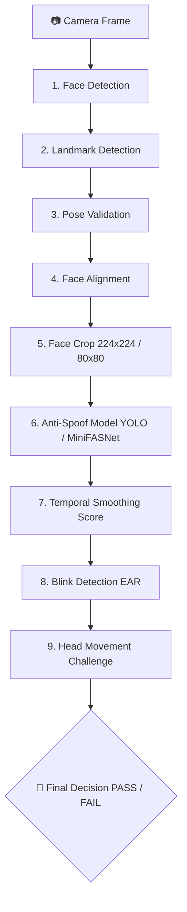

# 📋 SỔ TAY GHI CHÚ KIỂM THỬ (TEST NOTES & GUIDE)
> **Dự án:** Hệ thống eKYC Face ID - Anti-Spoofing & Liveness Detection  
> **Cập nhật ngày:** 01/09/2026

---

## 📑 MỤC LỤC
1. [Tổng quan Luồng eKYC Pipeline](#1-tổng-quan-luồng-ekyc-pipeline)
2. [Bảng tổng hợp nhanh các bài Test](#2-bảng-tổng-hợp-nhanh-các-bài-test)
3. [Chi tiết từng bài kiểm thử (Test Cases)](#3-chi-tiết-từng-bài-kiểm-thử-test-cases)
   - [Nhóm 1: Kiểm thử từng thành phần (Component Tests)](#nhóm-1-kiểm-thử-từng-thành-phần-component-tests)
   - [Nhóm 2: Kiểm thử Anti-Spoofing Models](#nhóm-2-kiểm-thử-anti-spoofing-models)
   - [Nhóm 3: Kiểm thử Liveness tương tác (Active Liveness)](#nhóm-3-kiểm-thử-liveness-tương-tác-active-liveness)
   - [Nhóm 4: Kiểm thử tích hợp Pipeline](#nhóm-4-kiểm-thử-tích-hợp-pipeline)
4. [Bảng phím tắt điều khiển (Hotkeys)](#4-bảng-phím-tắt-điều-khiển-hotkeys)
5. [Cấu hình Model & Môi trường chạy](#5-cấu-hình-model--môi-trường-chạy)
6. [Xử lý sự cố thường gặp (Troubleshooting)](#6-xử-lý-sự-cố-thường-gặp-troubleshooting)

---

## 1. 🌐 Tổng quan Luồng eKYC Pipeline

Hệ thống kiểm thử tuân theo lộ trình chuẩn 9 bước chuẩn Ngân hàng / eKYC:



---

## 2. 📊 Bảng tổng hợp nhanh các bài Test

| STT | File Test | Nhóm kiểm thử | Mục đích chính | Model / Công nghệ |
|:---:|:---|:---|:---|:---|
| 1 | `test_face_detection.py` | Component | Phát hiện mặt, vẽ Bounding Box, FPS | `Face_Detection.pt` (YOLO) |
| 2 | `test_landmark_detection.py` | Component | Trích xuất 468/478 điểm mốc khuôn mặt | `face_landmarker.task` (MediaPipe) |
| 3 | `test_pose_validation.py` | Component | Ước lượng góc nghiêng 3D (Yaw, Pitch, Roll) | PnP Solver + MediaPipe |
| 4 | `test_face_alignment_crop.py` | Component | Xoay thẳng mặt (Eye alignment) & Cắt vùng mặt | OpenCV Affine Transform |
| 5 | `test_anti_spoof.py` | Anti-Spoof | Nhận diện Real/Spoof trực tiếp qua YOLO | `Anti_Spoof_v7.pt` |
| 6 | `test_anti_spoof_minifasnet.py` | Anti-Spoof | Kiểm thử mạng MiniFASNetV2 với Face Crop | `Anti_Spoof_minifasnetv2_(9).pth` |
| 7 | `test_anti_spoof_mobilenetv2.py` | Anti-Spoof | Kiểm thử mạng MobileNetV2 (Hugging Face Safetensors 224x224) | `Model_MobilenetV2` (`model.safetensors`) |
| 8 | `test_anti_spoof_official_ensemble.py` | Anti-Spoof | Ensemble đa model MiniFASNet (V2 + V1SE) | `2.7_80x80_...pth` + `4_0_0_...pth` |
| 9 | `test_anti_spoof_yolov7_minifasnet_ensemble.py` | Anti-Spoof | Ensemble kết hợp YOLOv7 + MiniFASNet(4) | `Anti_Spoof_v7.pt` + `Anti_Spoof_minifasnetv2_(4).pth` |
| 10 | `test_head_movement.py` | Liveness | Thử thách cử động đầu (Trái/Phải/Lên/Xuống) | Pose Angle Tracker |
| 11 | `test_pipeline.py` | Pipeline v1 | Tích hợp Face Detection + Anti-Spoof cơ bản | YOLO Det + YOLO Anti-Spoof |
| 12 | `test_pipeline_2.py` | Pipeline v2 | Tích hợp Alignment, Crop & Smooth Score | Detection + Align + Anti-Spoof |
| 13 | `test_pipeline_3.py` | Pipeline v3 | Bổ sung Blink Detection (chớp mắt đo EAR) | Det + Align + Anti-Spoof + Blink |
| 14 | `test_pipeline_ensemble.py` | Pipeline Ensemble | Pipeline kết hợp Ensemble đa model MiniFASNet | MiniFASNet Ensemble + Pipeline |
| 15 | `test_pipeline_full.py` | Full eKYC v4 | Pipeline hoàn chỉnh: Chụp ảnh + Liveness + Báo cáo xuất ra file | Toàn bộ module + Export Report |
| 16 | `test_pipeline_yolov7_minifasnet_ensemble.py` | Full eKYC High FPS | Pipeline hoàn chỉnh tích hợp Ensemble YOLOv7 + MiniFASNet(4) | YOLOv7 + MiniFASNet(4) + Full eKYC |
| 17 | `test_anti_spoof_dual_minifasnet_ensemble.py` | Anti-Spoof | Ensemble 2 model MiniFASNet nội bộ mới nhất ((4) + (3)) | `Anti_Spoof_minifasnetv2_(4).pth` + `_(3).pth` |


---

## 3. 🔍 Chi tiết từng bài kiểm thử (Test Cases)

### Nhóm 1: Kiểm thử từng thành phần (Component Tests)

#### 1. `test_face_detection.py`
* **Mục tiêu:** Kiểm tra độ nhạy, bounding box và tốc độ FPS của model Face Detection.
* **Lệnh chạy:**
  ```powershell
  python tests/test_face_detection.py
  ```
* **Tiêu chí đạt:** Khung xanh bắt chính xác khuôn mặt khi di chuyển, không bị giật, hiển thị confidence score $\ge 0.7$.

#### 2. `test_landmark_detection.py`
* **Mục tiêu:** Kiểm tra trích xuất các điểm mốc chính: Mắt trái, mắt phải, mũi, miệng.
* **Lệnh chạy:**
  ```powershell
  python tests/test_landmark_detection.py
  ```
* **Tiêu chí đạt:** Các chấm landmark bám sát từng chuyển động của mắt, môi và sống mũi.

#### 3. `test_pose_validation.py`
* **Mục tiêu:** Kiểm tra thuật toán tính toán 3 góc Euler:
  * **Yaw:** Quay trái / phải ($-30^\circ \le \text{Yaw} \le 30^\circ$).
  * **Pitch:** Ngước lên / Cúi xuống ($-20^\circ \le \text{Pitch} \le 20^\circ$).
  * **Roll:** Nghiêng đầu ($-15^\circ \le \text{Roll} \le 15^\circ$).
* **Lệnh chạy:**
  ```powershell
  python tests/test_pose_validation.py
  ```
* **Tiêu chí đạt:** Báo `VALID` (xanh) khi nhìn thẳng, chuyển sang `INVALID` (đỏ/cam) kèm chỉ dẫn điều chỉnh khi quay lệch.

#### 4. `test_face_alignment_crop.py`
* **Mục tiêu:** Kiểm tra ma trận biến đổi Affine để xoay trục 2 mắt về đường nằm ngang và crop kích thước chuẩn $224 \times 224$ (hoặc $80 \times 80$).
* **Lệnh chạy:**
  ```powershell
  python tests/test_face_alignment_crop.py
  ```

---

### Nhóm 2: Kiểm thử Anti-Spoofing Models

#### 5. `test_anti_spoof.py`
* **Kiến trúc:** YOLO Anti-Spoofing (`Anti_Spoof_v7.pt` / `Anti_Spoof_v5.pt`).
* **Lệnh chạy:**
  ```powershell
  python tests/test_anti_spoof.py
  ```
* **Kịch bản test:**
  1. Mặt thật trước camera $\rightarrow$ Nhãn `Real` (Màu xanh).
  2. Đưa màn hình điện thoại/tablet có hình khuôn mặt $\rightarrow$ Nhãn `Spoof` (Màu đỏ).
  3. Đưa ảnh in giấy $\rightarrow$ Nhãn `Spoof` (Màu đỏ).

#### 6. `test_anti_spoof_minifasnet.py`
* **Kiến trúc:** MiniFASNetV2 (`.pth`) tối ưu hóa phát hiện giả mạo qua tần số Fourier & texture bề mặt.
* **Lệnh chạy:**
  ```powershell
  python tests/test_anti_spoof_minifasnet.py
  ```
* **Ưu điểm:** Kích thước siêu nhẹ (~230KB - 1.8MB), tốc độ inference cực nhanh trên CPU.

#### 7. `test_anti_spoof_mobilenetv2.py`
* **Kiến trúc:** MobileNetV2 Image Classification (`model.safetensors` từ `models/Model_MobilenetV2/`).
* **Kích thước đầu vào:** $224 \times 224$ pixels (RGB chuẩn hóa ImageNet).
* **Phân lớp:** `0: LIVE` (Khuôn mặt thật), `1: SPOOF` (Giả mạo ảnh in, màn hình điện thoại/máy tính, video...).
* **Lệnh chạy:**
  ```powershell
  # Chế độ Webcam trực tiếp
  python tests/test_anti_spoof_mobilenetv2.py

  # Test trên 1 ảnh đơn
  python tests/test_anti_spoof_mobilenetv2.py --image path/to/image.jpg

  # Test trên thư mục ảnh
  python tests/test_anti_spoof_mobilenetv2.py --dir path/to/folder/
  ```
* **Phím tắt:** `Q`/`ESC` (Thoát), `S` (Chụp ảnh), `C` (Bật/tắt thumbnail 224x224), `M` (Đổi tỷ lệ crop scale 1.0x-2.0x), `+/-` (Chỉnh threshold), `SPACE` (Tạm dừng).

#### 8. `test_anti_spoof_official_ensemble.py`
* **Kiến trúc:** Ensemble kết hợp đa tỷ lệ crop (Scale 2.7 + Scale 4.0) và đa kiến trúc (MiniFASNetV2 + MiniFASNetV1SE).
* **Lệnh chạy:**
  ```powershell
  python tests/test_anti_spoof_official_ensemble.py
  ```
* **Tiêu chí đạt:** Giảm tỷ lệ False Acceptance Rate (FAR) khi gặp các thủ thuật in ảnh chất lượng cao hoặc video replay.

#### 9. `test_anti_spoof_yolov7_minifasnet_ensemble.py`

* **Kiến trúc:** Ensemble đa mô hình khác biệt (Multi-Architecture):
  * **YOLO Anti-Spoof v7** (`Anti_Spoof_v7.pt`): Nhận diện tổng thể khuôn mặt & vật thể spoof trong bối cảnh.
  * **MiniFASNetV2(4)** (`Anti_Spoof_minifasnetv2_(4).pth`): Phân tích chi tiết vi mô (micro-texture) trên Face Crop 80x80.
* **Chiến lược:** Hỗ trợ linh hoạt 3 chế độ: `Weighted Soft Voting`, `Strict eKYC (min real)`, `Cascade`.
* **Lệnh chạy:**
  ```powershell
  # Chạy webcam tương tác trực tiếp
  python tests/test_anti_spoof_yolov7_minifasnet_ensemble.py

  # Hoặc test trên ảnh đơn / thư mục
  python tests/test_anti_spoof_yolov7_minifasnet_ensemble.py --image path/to/image.jpg
  python tests/test_anti_spoof_yolov7_minifasnet_ensemble.py --dir path/to/dir/
  ```

---

### Nhóm 3: Kiểm thử Liveness tương tác (Active Liveness)

#### 8. `test_head_movement.py`
* **Mục tiêu:** Thử thách người dùng thực hiện chuyển động đầu theo yêu cầu ngẫu nhiên:
  * `TURN_LEFT`: Quay đầu sang trái
  * `TURN_RIGHT`: Quay đầu sang phải
  * `LOOK_UP`: Ngước mặt lên trên
  * `LOOK_DOWN`: Cúi mặt xuống
* **Lệnh chạy:**
  ```powershell
  python tests/test_head_movement.py
  ```
* **Phím tắt hỗ trợ:**
  * `r` hoặc `c`: Đổi ngẫu nhiên thử thách mới.
  * `1`, `2`, `3`, `4`: Chọn trực tiếp thử thách Trái / Phải / Lên / Xuống.

---

### Nhóm 4: Kiểm thử tích hợp Pipeline

#### 9. `test_pipeline_full.py` (Phiên bản Toàn diện nhất)
* **Quy trình tương tác:**
  1. **Bước 1 (Preview & Capture):** Căn khuôn mặt vào khung chuẩn. Bấm `SPACE` (hoặc bấm `a` để tự động chụp khi Pose hợp lệ).
  2. **Bước 2 (Static Verification):** Hệ thống phân tích ảnh tĩnh: Face Det $\rightarrow$ Align $\rightarrow$ Crop $\rightarrow$ Anti-Spoofing Score.
  3. **Bước 3 (Active Verification):** Thử thách chớp mắt (Blink EAR) + Thử thách quay đầu ngẫu nhiên.
  4. **Bước 4 (Final Decision & Export):** Xuất toàn bộ ảnh crop, ảnh align và file JSON report vào thư mục `tests/output/<id>/`.
* **Lệnh chạy:**
  ```powershell
  python tests/test_pipeline_full.py
  ```
* **Kết quả đầu ra:**
  * `output/<id>/1_pipeline_result.jpg`: Ảnh chụp màn hình kết quả tổng quan.
  * `output/<id>/2_face_crop_224.jpg`: Ảnh khuôn mặt crop chuẩn $224\times224$.
  * `output/<id>/3_aligned_full.jpg`: Ảnh đã xoay thẳng góc mặt.
  * `output/<id>/4_report.json`: Báo cáo chi tiết các chỉ số (Score, Blink count, Pose angle, Decision).
  * `batch_summary_v4.csv` & `batch_summary_v4.json`: Lịch sử tất cả các phiên kiểm thử.

#### 15. `test_pipeline_yolov7_minifasnet_ensemble.py`
* **Kiến trúc:** Pipeline eKYC hoàn chỉnh thế hệ mới, tối ưu hóa tốc độ cao (30-60 FPS):
  * **Preview & Liveness:** Sử dụng Face Detection & MediaPipe Landmarks siêu nhẹ, không bị nghẽn FPS.
  * **Static AI Analysis:** Chạy mô hình kết hợp Ensemble giữa **YOLOv7** (`Anti_Spoof_v7.pt`) và **MiniFASNet(4)** (`Anti_Spoof_minifasnetv2_(4).pth`).
  * **Active Liveness:** Blink (chớp mắt) + Head Movement (quay đầu theo hướng).
* **Lệnh chạy:**
  ```powershell
  python tests/test_pipeline_yolov7_minifasnet_ensemble.py
  ```
* **Tham số bổ sung:**
  * `--auto`: Tự động chụp khi mặt nhìn thẳng và ổn định
  * `--quick`: Chế độ chụp nhanh bỏ qua thử thách Liveness
  * `--strategy {WEIGHTED,STRICT_EKYC,CASCADE}`: Chọn chiến lược gộp Ensemble

#### 16. `test_anti_spoof_dual_minifasnet_ensemble.py`
* **Kiến trúc:** Ensemble kết hợp 2 mô hình MiniFASNetV2 nội bộ mới nhất do dự án train (loại trừ 2 model official):
  * **Model 1:** `Anti_Spoof_minifasnetv2_(4).pth` (233.8 KB - Scale 1.2x)
  * **Model 2:** `Anti_Spoof_minifasnetv2_(3).pth` (232.5 KB - Scale 2.0x)
* **Ưu điểm:** Tốc độ siêu nhanh (~5-10 ms trên CPU), đạt **45 - 60+ FPS** mượt mà không giật lag.
* **Lệnh chạy:**
  ```powershell
  # Chạy webcam thời gian thực tốc độ cao
  python tests/test_anti_spoof_dual_minifasnet_ensemble.py

  # Test trên ảnh hoặc thư mục
  python tests/test_anti_spoof_dual_minifasnet_ensemble.py --image path/to/image.jpg
  python tests/test_anti_spoof_dual_minifasnet_ensemble.py --dir path/to/dir/
  ```

---

## 4. ⌨️ Bảng phím tắt điều khiển (Hotkeys)

| Phím | Chức năng trong bài Test | File áp dụng |
|:---:|:---|:---|
| `ESC` / `q` | Thoát ứng dụng và đóng camera | Tất cả các file test |
| `SPACE` / `c` | Chụp ảnh để bắt đầu quy trình eKYC | `test_pipeline_full.py` |
| `a` | Bật / Tắt chế độ tự động chụp (Auto-capture) | `test_pipeline_full.py` |
| `r` | Reset phiên eKYC mới / Đổi thử thách ngẫu nhiên | `test_pipeline_full.py`, `test_head_movement.py` |
| `1` - `4` | Chọn nhanh thử thách quay đầu (Trái / Phải / Lên / Xuống) | `test_head_movement.py` |

---

## 5. ⚙️ Cấu hình Model & Môi trường chạy

### Đường dẫn trọng số mô hình (`models/`):
* **Face Detection:** `models/Face_Detection.pt`
* **Landmarks:** `models/face_landmarker.task`
* **Anti-Spoof YOLO:** `models/Anti_Spoof_v7.pt` (hoặc `v1` đến `v5`)
* **Anti-Spoof MiniFASNet:** `models/Anti_Spoof_minifasnetv2_(9).pth`
* **Ensemble Models:** `models/2.7_80x80_MiniFASNetV2.pth` & `models/4_0_0_80x80_MiniFASNetV1SE.pth`

### Cấu hình ngưỡng khuyến nghị (Default Thresholds):
* **Face Det Confidence:** $\ge 0.60$
* **Anti-Spoof Real Threshold:** $\ge 0.70$
* **Blink EAR Threshold:** $\le 0.21$ (Mắt nhắm) / $\ge 0.27$ (Mắt mở)
* **Pose Angles Limit:** $|\text{Yaw}| \le 15^\circ$, $|\text{Pitch}| \le 15^\circ$, $|\text{Roll}| \le 10^\circ$

---

## 6. 🛠️ Xử lý sự cố thường gặp (Troubleshooting)

| Lỗi / Hiện tượng | Nguyên nhân | Cách khắc phục |
|:---|:---|:---|
| `Cannot open camera!` | Camera đang bị ứng dụng khác (Zoom, Teams, Browser) chiếm dụng hoặc ID camera sai | Tắt các ứng dụng dùng cam, thử đổi `cv2.VideoCapture(0)` thành `1` hoặc `2`. |
| `FileNotFoundError: models/...` | Thiếu file trọng số hoặc sai đường dẫn tương đối | Kiểm tra thư mục `models/`, chạy script từ thư mục gốc dự án (`Face-Project/`). |
| `ModuleNotFoundError: No module named 'src'` | Chưa nạp root path vào `sys.path` | Chạy lệnh bằng cú pháp: `python tests/<tên_test>.py` từ thư mục gốc. |
| `KeyboardInterrupt` khi đang load model | Bấm `Ctrl + C` ngắt tiến trình giữa chừng khi PyTorch/YOLO đang compile đồ thị | Đợi 2-3 giây ở lần đầu tiên model khởi tạo trên CPU. |
| Model chạy chậm / giật hình | Đang chạy thuần CPU hoặc độ phân giải camera quá lớn | Chỉnh kích thước frame `cap.set(cv2.CAP_PROP_FRAME_WIDTH, 640)` và `HEIGHT, 480`. |
| Nhận diện nhầm Spoof thành Real dưới ánh đèn mạnh | Hiện tượng chóa sáng (Glare) làm mất texture da | Đảm bảo ánh sáng rọi đều khuôn mặt, tránh bóng đèn chiếu thẳng phía sau lưng. |
