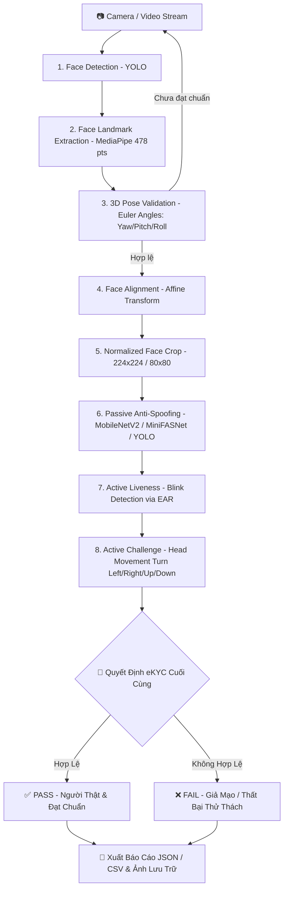

# 📋 SỔ TAY GHI CHÚ KIỂM THỬ (TEST NOTES & GUIDE)
> **Dự án:** Hệ thống eKYC Face ID - Anti-Spoofing & Liveness Detection  
> **Cập nhật ngày:** 04/09/2026

---

## 📑 MỤC LỤC
1. [Tổng quan Luồng eKYC Pipeline](#1-tổng-quan-luồng-ekyc-pipeline)
2. [Bảng tổng hợp nhanh các bài Test](#2-bảng-tổng-hợp-nhanh-các-bài-test)
3. [Chi tiết từng bài kiểm thử (Test Cases)](#3-chi-tiết-từng-bài-kiểm-thử-test-cases)
   - [Nhóm 1: Kiểm thử từng thành phần (Component Tests)](#nhóm-1-kiểm-thử-từng-thành-phần-component-tests)
   - [Nhóm 2: Kiểm thử Anti-Spoofing Models](#nhóm-2-kiểm-thử-anti-spoofing-models)
   - [Nhóm 3: Kiểm thử Liveness tương tác (Active Liveness)](#nhóm-3-kiểm-thử-liveness-tương-tác-active-liveness)
   - [Nhóm 4: Kiểm thử tích hợp Pipeline](#nhóm-4-kiểm-thử-tích-hợp-pipeline)
4. [Bảng phím tắt điều khiển (Hotkeys)](#4-bảng-phím-tắt-điều-khiển-hotkeys)
5. [Cấu hình Model & Môi trường chạy](#5-cấu-hình-model--môi-trường-chạy)
6. [Xử lý sự cố thường gặp (Troubleshooting)](#6-xử-lý-sự-cố-thường-gặp-troubleshooting)

---

## 1. 🌐 Tổng quan Luồng eKYC Pipeline

Hệ thống kiểm thử tuân theo lộ trình chuẩn quy định Ngân hàng / eKYC:



---

## 2. 📊 Bảng tổng hợp nhanh các bài Test

| STT | File Test | Nhóm kiểm thử | Mục đích chính | Model / Công nghệ |
|:---:|:---|:---|:---|:---|
| 1 | `test_face_detection.py` | Component | Phát hiện mặt, vẽ Bounding Box, FPS | `Face_Detection.pt` (YOLO) |
| 2 | `test_landmark_detection.py` | Component | Trích xuất 468/478 điểm mốc khuôn mặt | `face_landmarker.task` (MediaPipe) |
| 3 | `test_pose_validation.py` | Component | Ước lượng góc nghiêng 3D (Yaw, Pitch, Roll) | PnP Solver + MediaPipe |
| 4 | `test_face_alignment_crop.py` | Component | Xoay thẳng mặt (Eye alignment) & Cắt vùng mặt | OpenCV Affine Transform |
| 5 | `test_anti_spoof.py` | Anti-Spoof | Nhận diện Real/Spoof trực tiếp qua YOLO | `Anti_Spoof_YOLO.pt` |
| 6 | `test_anti_spoof_minifasnet.py` | Anti-Spoof | Kiểm thử mạng MiniFASNetV2 với Face Crop | `Anti_Spoof_minifasnet.pth` |
| 7 | `test_anti_spoof_mobilenetv2.py` | Anti-Spoof | Kiểm thử mạng MobileNetV2 (Hugging Face Safetensors 224x224) | `Model_MobilenetV2` (`model.safetensors`) |
| 8 | `test_anti_spoof_official_ensemble.py` | Anti-Spoof | Ensemble đa model MiniFASNet (V2 + V1SE) | `2.7_80x80_...pth` + `4_0_0_...pth` |
| 9 | `test_head_movement.py` | Liveness | Thử thách cử động đầu (Trái/Phải/Lên/Xuống) | Pose Angle Tracker |
| 10 | `test_pipeline.py` | Pipeline v1 | Tích hợp Face Detection + Anti-Spoof cơ bản | YOLO Det + YOLO Anti-Spoof |
| 11 | `test_pipeline_2.py` | Pipeline v2 | Tích hợp Alignment, Crop & Smooth Score | Detection + Align + Anti-Spoof |
| 12 | `test_pipeline_3.py` | Pipeline v3 | Bổ sung Blink Detection (chớp mắt đo EAR) | Det + Align + Anti-Spoof + Blink |
| 13 | `test_pipeline_ensemble.py` | Pipeline Ensemble | Pipeline kết hợp Ensemble đa model MiniFASNet | MiniFASNet Ensemble + Pipeline |
| 14 | `test_pipeline_mobilenet.py` | Full eKYC MobileNetV2 | Quy trình hoàn chỉnh với MobileNetV2: Chụp ảnh -> AI -> Chớp mắt -> Quay đầu -> Báo cáo | `Model_MobilenetV2` (Threshold 0.6) |
| 15 | `test_pipeline_full.py` | Full eKYC YOLOv8 | Quy trình hoàn chỉnh với YOLO: Chụp ảnh -> AI -> Chớp mắt -> Quay đầu -> Báo cáo | `Anti_Spoof_YOLO.pt` + Full eKYC |

> [!TIP]
> **Khuyên dùng:** Sử dụng lệnh `py` (trình khởi chạy Python có sẵn của Windows) để chạy các file test nhằm đảm bảo gọi đúng môi trường Python 3.11 đã cài đặt đầy đủ OpenCV, PyTorch và MediaPipe.

---

## 3. 🔍 Chi tiết từng bài kiểm thử (Test Cases)

### Nhóm 1: Kiểm thử từng thành phần (Component Tests)

#### 1. `test_face_detection.py`
* **Mục tiêu:** Kiểm tra độ nhạy, bounding box và tốc độ FPS của model Face Detection.
* **Lệnh chạy:**
  ```powershell
  py tests/test_face_detection.py
  ```
* **Tiêu chí đạt:** Khung xanh bắt chính xác khuôn mặt khi di chuyển, không bị giật, hiển thị confidence score $\ge 0.7$.

#### 2. `test_landmark_detection.py`
* **Mục tiêu:** Kiểm tra trích xuất 478 điểm mốc khuôn mặt (MediaPipe Face Landmarker Tasks API).
* **Lệnh chạy:**
  ```powershell
  py tests/test_landmark_detection.py
  ```
* **Tiêu chí đạt:** Các chấm landmark bám sát từng chuyển động của mắt, môi và sống mũi.

#### 3. `test_pose_validation.py`
* **Mục tiêu:** Kiểm tra thuật toán tính toán 3 góc Euler:
  * **Yaw:** Quay trái / phải ($-30^\circ \le \text{Yaw} \le 30^\circ$).
  * **Pitch:** Ngước lên / Cúi xuống ($-20^\circ \le \text{Pitch} \le 20^\circ$).
  * **Roll:** Nghiêng đầu ($-15^\circ \le \text{Roll} \le 15^\circ$).
* **Lệnh chạy:**
  ```powershell
  py tests/test_pose_validation.py
  ```
* **Tiêu chí đạt:** Báo `VALID` (xanh) khi nhìn thẳng, chuyển sang `INVALID` (đỏ/cam) kèm chỉ dẫn điều chỉnh khi quay lệch.

#### 4. `test_face_alignment_crop.py`
* **Mục tiêu:** Kiểm tra ma trận biến đổi Affine để xoay trục 2 mắt về đường nằm ngang và crop kích thước chuẩn $224 \times 224$ (hoặc $80 \times 80$).
* **Lệnh chạy:**
  ```powershell
  py tests/test_face_alignment_crop.py
  ```
* **Tiêu chí đạt:** Khuôn mặt được xoay thẳng trục mắt, tỷ lệ crop cân đối, không bị méo hình.

---

### Nhóm 2: Kiểm thử Anti-Spoofing Models

#### 5. `test_anti_spoof.py`
* **Kiến trúc:** YOLO Anti-Spoofing (`Anti_Spoof_YOLO.pt`).
* **Lệnh chạy:**
  ```powershell
  py tests/test_anti_spoof.py
  ```
* **Kịch bản test:**
  1. Mặt thật trước camera $\rightarrow$ Nhãn `Real` (Màu xanh).
  2. Đưa màn hình điện thoại/tablet có hình khuôn mặt $\rightarrow$ Nhãn `Spoof` (Màu đỏ).
  3. Đưa ảnh in giấy $\rightarrow$ Nhãn `Spoof` (Màu đỏ).

#### 6. `test_anti_spoof_minifasnet.py`
* **Kiến trúc:** MiniFASNetV2 (`Anti_Spoof_minifasnet.pth`) phân tích tần số Fourier và micro-texture trên Face Crop $80 \times 80$.
* **Lệnh chạy:**
  ```powershell
  py tests/test_anti_spoof_minifasnet.py
  ```
* **Ưu điểm:** Kích thước siêu nhẹ (~239 KB), tốc độ inference cực nhanh trên CPU.

#### 7. `test_anti_spoof_mobilenetv2.py`
* **Kiến trúc:** MobileNetV2 Image Classification (`model.safetensors` từ `models/Model_MobilenetV2/`).
* **Kích thước đầu vào:** $224 \times 224$ pixels (RGB chuẩn hóa ImageNet).
* **Phân lớp:** `0: LIVE` (Khuôn mặt thật), `1: SPOOF` (Giả mạo ảnh in, màn hình, video phát lại...).
* **Lệnh chạy:**
  ```powershell
  # Chế độ Webcam trực tiếp
  py tests/test_anti_spoof_mobilenetv2.py

  # Test trên 1 ảnh đơn
  py tests/test_anti_spoof_mobilenetv2.py --image data_raw/0.jpg

  # Test trên thư mục ảnh
  py tests/test_anti_spoof_mobilenetv2.py --dir data_raw/
  ```

#### 8. `test_anti_spoof_official_ensemble.py`
* **Kiến trúc:** Ensemble 2 mô hình MiniFASNet chính thức:
  1. Model 1: `2.7_80x80_MiniFASNetV2.pth` (Scale 2.7x - Vùng mặt gần)
  2. Model 2: `4_0_0_80x80_MiniFASNetV1SE.pth` (Scale 4.0x - Vùng ngữ cảnh rộng)
* **Lệnh chạy:**
  ```powershell
  py tests/test_anti_spoof_official_ensemble.py
  ```

---

### Nhóm 3: Kiểm thử Liveness tương tác (Active Liveness)

#### 9. `test_head_movement.py`
* **Mục tiêu:** Thử thách người dùng thực hiện chuyển động đầu theo yêu cầu ngẫu nhiên:
  * `TURN_LEFT`: Quay đầu sang trái
  * `TURN_RIGHT`: Quay đầu sang phải
  *(Đã loại bỏ `LOOK_UP` và `LOOK_DOWN` khỏi danh sách thử thách ngẫu nhiên để tối ưu hóa góc nhận diện camera và trải nghiệm người dùng)*
* **Lệnh chạy:**
  ```powershell
  py tests/test_head_movement.py
  ```
* **Phím tắt hỗ trợ:**
  * `r` hoặc `c`: Đổi ngẫu nhiên thử thách mới (Trái / Phải).
  * `1`, `2`: Chọn trực tiếp thử thách Trái / Phải.

---

### Nhóm 4: Kiểm thử tích hợp Pipeline

#### 10. `test_pipeline.py` (Pipeline v1: Detection + Anti-Spoof Cơ Bản)
* **Mục tiêu:** Kiểm tra tích hợp module Face Detection (YOLO) và mô hình Anti-Spoofing đầu tiên.
* **Lệnh chạy:**
  ```powershell
  py tests/test_pipeline.py
  ```
* **Chức năng:** Tự động phát hiện khuôn mặt trong khung hình camera, cắt bounding box và suy luận trực tiếp trạng thái Real / Spoof.

#### 11. `test_pipeline_2.py` (Pipeline v2: Căn Chỉnh Mặt & Làm Mượt Điểm)
* **Mục tiêu:** Bổ sung bước Face Alignment (Affine Transform căn thẳng trục 2 mắt) và bộ lọc làm mượt điểm số theo thời gian (Temporal Confidence Smoothing).
* **Lệnh chạy:**
  ```powershell
  py tests/test_pipeline_2.py
  ```
* **Cải tiến:** Triệt tiêu hoàn toàn góc nghiêng đầu trước khi phân loại, giữ xác suất ổn định không bị chớp nháy giữa các frame liên tiếp.

#### 12. `test_pipeline_3.py` (Pipeline v3: Bổ Sung Phát Hiện Chớp Mắt)
* **Mục tiêu:** Tích hợp kiểm tra cử động sống thụ động thông qua đo tỷ lệ co giãn mí mắt (Eye Aspect Ratio - EAR).
* **Lệnh chạy:**
  ```powershell
  py tests/test_pipeline_3.py
  ```
* **Chức năng:** Người dùng cần chớp mắt tự nhiên 1-2 lần để vượt qua bài kiểm tra sinh trắc học trước khi xác nhận người thật.

#### 13. `test_pipeline_ensemble.py` (Pipeline Đa Mô Hình MiniFASNet Ensemble)
* **Mục tiêu:** Kết hợp đồng thời 2 mô hình MiniFASNet chính thức với 2 tỉ lệ mở rộng khác nhau:
  * Model 1: `2.7_80x80_MiniFASNetV2.pth` (Scale 2.7x)
  * Model 2: `4_0_0_80x80_MiniFASNetV1SE.pth` (Scale 4.0x)
* **Lệnh chạy:**
  ```powershell
  py tests/test_pipeline_ensemble.py
  ```
* **Ưu điểm:** Kháng tấn công màn hình và ảnh in với độ tin cậy vượt trội nhờ phân tích đa vùng ngữ cảnh.

#### 14. `test_pipeline_mobilenet.py` (Pipeline eKYC Tương Tác Với MobileNetV2)
* **Mô tả:** Pipeline eKYC hoàn chỉnh tích hợp model MobileNetV2 Safetensors 224x224. Mặc định mở Webcam tương tác trực tiếp với ngưỡng Real threshold **0.6**.
* **Quy trình thực hiện:**
  1. **Bước 1 (Preview & Align):** Căn mặt vào vị trí chuẩn, kiểm tra khoảng cách và góc nghiêng 3D. Nhấn `SPACE` hoặc `c` để chụp (hoặc `a` để tự động chụp khi căn chuẩn).
  2. **Bước 2 (Chạy AI Model tĩnh):** Lưu ảnh gốc vào `data_raw/<id>.jpg`, chạy Face Detection -> Landmark -> Pose 3D -> Face Align & Crop 224x224 -> **MobileNetV2 Anti-Spoof** (ngưỡng 0.6).
  3. **Bước 3 (Thử thách chớp mắt):** Chuyển sang luồng live webcam yêu cầu chớp mắt (đo EAR).
  4. **Bước 4 (Thử thách cử động đầu):** Yêu cầu quay đầu theo hướng ngẫu nhiên (Trái/Phải/Lên/Xuống) có đếm ngược thời gian.
  5. **Bước 5 (Tổng hợp quyết định & Xuất file):** Lưu kết quả chi tiết vào `output/pipeline_mobilenet/<id>/` và cập nhật file tổng kết `batch_summary_mobilenet.csv`.
* **Lệnh chạy:**
  ```powershell
  # Chế độ Webcam trực tiếp (MẶC ĐỊNH)
  py tests/test_pipeline_mobilenet.py

  # Duyệt toàn bộ thư mục ảnh mẫu
  py tests/test_pipeline_mobilenet.py --batch

  # Chụp nhanh bỏ qua bước Liveness
  py tests/test_pipeline_mobilenet.py --static
  ```
* **Kết quả đầu ra (`output/pipeline_mobilenet/<id>/`):**
  * `1_pipeline_result.jpg`: Ảnh chụp kèm Dashboard HUD đầy đủ thông số.
  * `1_pipeline_result_clean.jpg`: Ảnh kết quả sạch chỉ có badge kết quả.
  * `2_face_crop_224.jpg`: Ảnh khuôn mặt $224 \times 224$ đưa vào MobileNetV2.
  * `3_aligned_full.jpg`: Ảnh toàn cảnh đã xoay thẳng trục mắt.
  * `4_report.json`: Báo cáo chi tiết dạng JSON.

#### 15. `test_pipeline_full.py` (Pipeline eKYC Tương Tác Với YOLOv8)
* **Mô tả:** Quy trình eKYC tương tác chuẩn tích hợp mô hình YOLO Anti-Spoofing (`Anti_Spoof_YOLO.pt`).
* **Lệnh chạy:**
  ```powershell
  py tests/test_pipeline_full.py
  ```
* **Kết quả đầu ra (`output/<id>/`):**
  * `1_pipeline_result.jpg`, `1_pipeline_result_clean.jpg`, `2_face_crop_224.jpg`, `3_aligned_full.jpg`, `4_report.json`.
  * `batch_summary_v4.csv` và `batch_summary_v4.json`.

---

## 4. ⌨️ Bảng phím tắt điều khiển (Hotkeys)

| Phím Tắt | Chức Năng | File Áp Dụng |
|:---:|:---|:---|
| <kbd>SPACE</kbd> / <kbd>c</kbd> | Chụp ảnh và bắt đầu chu trình eKYC đầy đủ | `test_pipeline_mobilenet.py`, `test_pipeline_full.py` |
| <kbd>s</kbd> | Chụp nhanh & Lưu ngay (Bỏ qua thử thách Liveness) | `test_pipeline_mobilenet.py`, `test_pipeline_full.py` |
| <kbd>a</kbd> | Bật / Tắt chế độ **Auto-Capture** (tự động chụp khi mặt chuẩn) | `test_pipeline_mobilenet.py`, `test_pipeline_full.py` |
| <kbd>r</kbd> | Reset phiên eKYC mới (ảnh ID tiếp theo) / Đổi thử thách mới | `test_pipeline_mobilenet.py`, `test_pipeline_full.py`, `test_head_movement.py` |
| <kbd>1</kbd> - <kbd>4</kbd> | Chọn trực tiếp hướng thử thách quay đầu (Trái / Phải / Lên / Xuống) | `test_head_movement.py` |
| <kbd>ESC</kbd> / <kbd>q</kbd> | Thoát chương trình an toàn | Tất cả các file test |

---

## 5. ⚙️ Cấu hình Model & Môi trường chạy

### Danh mục trọng số mô hình (`models/`):
* **Face Detection:** `models/Face_Detection.pt` (YOLO Face)
* **Landmarks 3D:** `models/face_landmarker.task` (MediaPipe 478 points)
* **Anti-Spoof YOLO:** `models/Anti_Spoof_YOLO.pt`
* **Anti-Spoof MiniFASNet:** `models/Anti_Spoof_minifasnet.pth`
* **Anti-Spoof Ensemble:** `models/2.7_80x80_MiniFASNetV2.pth` & `models/4_0_0_80x80_MiniFASNetV1SE.pth`
* **Anti-Spoof MobileNetV2:** `models/Model_MobilenetV2/` (`model.safetensors`, input $224 \times 224$)

### Cấu hình ngưỡng chuẩn (Recommended Thresholds):
* **Face Detection Confidence:** $\ge 0.70$
* **MobileNetV2 Real Threshold:** $\ge 0.60$ (Mặc định)
* **Anti-Spoof YOLO Threshold:** $\ge 0.60$
* **Blink EAR Threshold:** $\le 0.18$ (Mắt nhắm) / $\ge 0.22$ (Mắt mở)
* **Pose Angles Limit:** $|\text{Yaw}| \le 20^\circ$, $|\text{Pitch}| \le 15^\circ$, $|\text{Roll}| \le 12^\circ$

---

## 6. 🛠️ Xử lý sự cố thường gặp (Troubleshooting)

| Lỗi / Hiện tượng | Nguyên nhân | Cách khắc phục |
|:---|:---|:---|
| `ModuleNotFoundError: No module named 'cv2'` | Chạy bằng `python` của MSYS2 (`C:\msys64\ucrt64\bin\python.exe`) chưa cài OpenCV | Chạy bằng lệnh: `py tests/<tên_test>.py` hoặc mở terminal mới sau khi PATH đã cập nhật. |
| `Cannot open camera!` | Camera đang bị ứng dụng khác (Zoom, Teams, Browser) chiếm dụng hoặc ID camera sai | Đóng ứng dụng dùng camera, thử thêm cờ `--cam 1` hoặc `--cam 2`. |
| `FileNotFoundError: models/...` | Thiếu file trọng số hoặc chạy script ngoài thư mục dự án | Kiểm tra thư mục `models/`, đứng tại thư mục gốc `Face-Project/` để chạy lệnh. |
| `KeyboardInterrupt` khi đang load model | Bấm `Ctrl + C` ngắt tiến trình giữa chừng khi PyTorch/YOLO đang compile đồ thị | Đợi 2-3 giây ở lần đầu tiên model khởi tạo trên CPU. |
| Model chạy chậm / giật FPS | Đang chạy thuần CPU hoặc độ phân giải camera quá lớn | Chỉnh kích thước frame trong code hoặc dùng card đồ họa NVIDIA CUDA. |
| Nhận diện nhầm Spoof thành Real dưới ánh đèn mạnh | Hiện tượng chóa sáng (Glare) làm mất chi tiết da mặt | Đảm bảo ánh sáng rọi đều khuôn mặt, tránh bóng đèn chiếu thẳng phía sau lưng. |
