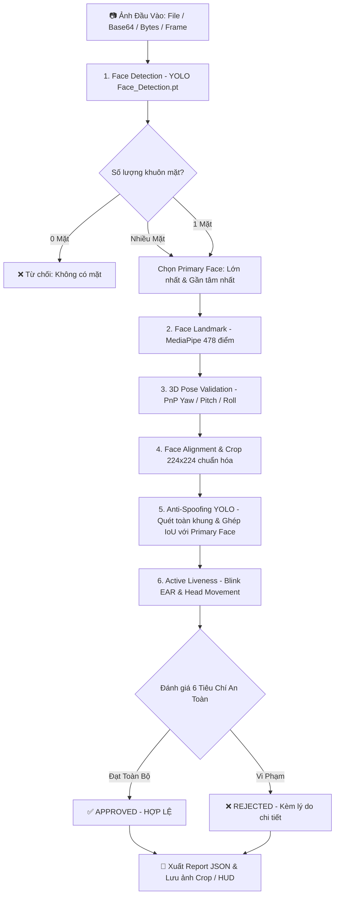

# 🛡️ E-KYC Server Module (YOLO Engine)

Module máy chủ chuyên trách tính toán Computer Vision và Trí tuệ nhân tạo (AI) cho hệ thống xác thực sinh trắc học khuôn mặt eKYC, được xây dựng và chuẩn hóa trực tiếp từ quy trình **`tests/test_pipeline_full.py`**.

Module này được thiết kế theo dạng **gói độc lập (Self-contained Package)**, sẵn sàng để đóng gói và **upload thẳng lên server** để tích hợp vào hệ thống backend hiện tại (hỗ trợ cả Python Server lẫn Server Node.js).

> [!IMPORTANT]
> **THIẾT KẾ THUẦN XỬ LÝ ẢNH (HEADLESS SERVER MODE)**:
> - **Chỉ nhận ảnh đầu vào**: Module hoạt động 100% trên dữ liệu ảnh tĩnh và frame buffer (`File Path`, `Base64`, `Bytes Buffer`, hoặc `NumPy Array`).
> - **Tuyệt đối KHÔNG chạy webcam**: Không gọi `cv2.VideoCapture()`, không kết nối camera phần cứng, không sử dụng giao diện đồ họa hiển thị (`cv2.imshow()`, `cv2.waitKey()`).
> - **Sẵn sàng triển khai Headless**: Đảm bảo chạy mượt mà, không gây lỗi thiếu display (`DISPLAY not set`) trên môi trường Server không màn hình (Ubuntu/Debian Server, Docker Container, AWS/GCP/DigitalOcean Cloud VM).

---

## 📑 Mục Lục
1. [Kiến Trúc & Quy Trình Xử Lý AI](#1-kiến-trúc--quy-trình-xử-lý-ai)
2. [Danh Sách Mô Hình AI (YOLO Weights)](#2-danh-sách-mô-hình-ai-yolo-weights)
3. [Cấu Trúc Thư Mục `server_module/`](#3-cấu-trúc-thư-mục-server_module)
4. [Hướng Dẫn Upload & Cài Đặt Trên Server](#4-hướng-dẫn-upload--cài-đặt-trên-server)
5. [Hướng Dẫn Tích Hợp Python](#5-hướng-dẫn-tích-hợp-python)
6. [Hướng Dẫn Tích Hợp Với Server Node.js](#6-hướng-dẫn-tích-hợp-với-server-nodejs)
7. [Cấu Trúc Báo Cáo Đầu Ra (JSON Report)](#7-cấu-trúc-báo-cáo-đầu-ra-json-report)
8. [Dự Trù Tích Hợp Với Thiết Bị MCU Edge (ESP32-CAM)](#8-dự-trù-tích-hợp-với-thiết-bị-mcu-edge-esp32-cam)

---

## 1. Kiến Trúc & Quy Trình Xử Lý AI

Quy trình xử lý tuân thủ chặt chẽ lộ trình eKYC chuẩn FinTech/Ngân hàng từ `test_pipeline_full.py`:



### 6 Tiêu chí an toàn bắt buộc:
1. **`face_detected`**: Có mặt người trong khung hình.
2. **`single_face`**: Duy nhất 1 người (không bị người đứng sau xen vào).
3. **`pose_valid`**: Góc mặt thẳng chuẩn (Yaw $\le 25^\circ$, Pitch $\le 20^\circ$, Roll $\le 15^\circ$, không ngồi quá xa).
4. **`anti_spoof_real`**: YOLO Anti-Spoof xác nhận `REAL` (loại bỏ màn hình điện thoại, ảnh in giấy, video replay).
5. **`blink_passed`**: Người dùng có chớp mắt tự nhiên (đo bằng tỷ lệ co giãn mí mắt EAR).
6. **`head_movement_passed`**: Hoàn thành thử thách cử động đầu ngẫu nhiên (Quay trái / Quay phải).

---

## 2. Danh Sách Mô Hình AI (YOLO Weights)

Module sử dụng các file weights đặt tại thư mục `models/` (ngang cấp với `server_module/`):

| Tên File Model | Vị Trí Mặc Định | Nhiệm Vụ |
|:---|:---|:---|
| Tên File Model | Vị Trí Nội Bộ Trong Module | Nhiệm Vụ |
|:---|:---|:---|
| **`Face_Detection.pt`** | `server_module/models/Face_Detection.pt` | Phát hiện bounding box toàn bộ khuôn mặt trong ảnh với tốc độ cao. |
| **`Anti_Spoof_YOLO.pt`** | `server_module/models/Anti_Spoof_YOLO.pt` | Mô hình YOLO Anti-Spoofing phân biệt mặt người thật và giả mạo (Fake/Spoof). |
| **`face_landmarker.task`** | `server_module/models/face_landmarker.task` | Trích xuất 478 tọa độ 3D landmarks phục vụ căn chỉnh mắt, đo góc và đo EAR chớp mắt. |

---

## 3. Cấu Trúc Thư Mục Tự Đóng Gói (100% Self-Contained)

```
server_module/
│
├── models/                           # [ĐÃ COPY SẴN] Toàn bộ file weights AI cần thiết
│   ├── Face_Detection.pt             # YOLO Face Detection
│   ├── Anti_Spoof_YOLO.pt            # YOLO Anti-Spoofing
│   └── face_landmarker.task          # MediaPipe 478 Landmarks
│
├── components/                       # [ĐÃ ĐÓNG GÓI NỘI BỘ] Các thành phần xử lý hình học & cử động
│   ├── __init__.py
│   ├── face_detection/               # Bộ phát hiện khuôn mặt
│   ├── landmark_detection/           # Bộ trích xuất landmarks MediaPipe
│   ├── pose_validation/              # Bộ tính toán góc xoay 3D Euler (Yaw/Pitch/Roll)
│   ├── face_alignment_crop/          # Bộ căn chỉnh Affine và crop chuẩn 224x224
│   └── head_movement/                # Bộ quản lý thử thách quay đầu ngẫu nhiên
│
├── __init__.py                       # Khởi tạo package, export EKYCPipelineServer, AntiSpoofYoloDetector
├── config.py                         # Cấu hình đường dẫn model, các ngưỡng góc Pose, EAR và timeout
├── pipeline_server.py                # Core Engine: Đóng gói toàn bộ quy trình AI
├── anti_spoof_yolo.py                # Wrapper chuyên biệt cho Anti_Spoof_YOLO.pt
├── utils.py                          # Nạp ảnh đa năng (File/Base64/Bytes), tính IoU, EAR, vẽ HUD
├── runner.py                         # CLI & IPC Bridge cho Node.js gọi qua child_process (JSON in/out)
└── README.md                         # Tài liệu hướng dẫn sử dụng và tích hợp
```

---

## 4. Hướng Dẫn Upload & Cài Đặt Trên Server

### Bước 1: Copy DUY NHẤT thư mục `server_module/` lên server
Do toàn bộ mô hình weights và components đã được đóng gói khép kín bên trong, bạn **chỉ cần copy duy nhất thư mục `server_module/`** lên máy chủ production (không phụ thuộc vào bất kỳ file nào bên ngoài).

### Bước 2: Cài đặt thư viện phụ thuộc
Chạy lệnh sau trên máy chủ (Ubuntu/Linux hoặc Windows Server):
```bash
pip install opencv-python-headless numpy ultralytics mediapipe torch torchvision
```

---

## 5. Hướng Dẫn Tích Hợp Python

Nếu server của bạn viết bằng Python, bạn có thể import trực tiếp như một thư viện nội bộ:

```python
from server_module import EKYCPipelineServer

# 1. Khởi tạo pipeline server (tự động load YOLO models)
server = EKYCPipelineServer()

# 2. Kiểm tra tư thế trước khi chụp (Pre-capture check)
pose_result = server.validate_pose("path/to/preview_frame.jpg")
print("Tư thế hợp lệ:", pose_result["is_valid"])
print("Hướng dẫn:", pose_result["guide"])

# 3. Kiểm tra chống giả mạo tĩnh (Passive Anti-Spoofing)
spoof_result = server.check_antispoof("path/to/captured_image.jpg")
print("Là người thật:", spoof_result["is_real"])
print("Độ tự tin:", spoof_result["confidence"])

# 4. Chạy toàn bộ quy trình tổng hợp eKYC
report = server.full_verify(
    image_input="path/to/captured_image.jpg",
    img_id="user_12345",
    blink_passed=True,
    head_movement_passed=True,
    output_dir="output/"  # Tự động xuất ảnh kết quả kèm HUD và file 4_report.json
)

print("Kết quả duyệt:", report["final_decision"]["verdict"])  # "APPROVED" hoặc "REJECTED"
```

---

## 6. Hướng Dẫn Tích Hợp Với Server Node.js

Nếu Server chính của bạn được viết bằng **Node.js**, bạn có thể gọi `server_module` thông qua cầu nối **`runner.py`** bằng module có sẵn `child_process`:

### Code mẫu trong Node.js:

```javascript
const { spawn } = require('child_process');
const path = require('path');

/**
 * Gọi module Python E-KYC xử lý ảnh
 * @param {string} imagePathOrBase64 Đường dẫn ảnh hoặc chuỗi Base64
 * @param {string} action 'full_verify' | 'validate_pose' | 'check_antispoof'
 * @returns {Promise<Object>} Kết quả phân tích JSON từ AI
 */
function runEkycAI(imagePathOrBase64, action = 'full_verify') {
    return new Promise((resolve, reject) => {
        const pythonProcess = spawn('python', [
            '-m', 'server_module.runner',
            '--action', action,
            '--input', imagePathOrBase64,
            '--img-id', Date.now().toString()
        ]);

        let outputData = '';
        let errorData = '';

        pythonProcess.stdout.on('data', (data) => {
            outputData += data.toString('utf8');
        });

        pythonProcess.stderr.on('data', (data) => {
            errorData += data.toString('utf8');
        });

        pythonProcess.on('close', (code) => {
            if (code !== 0) {
                return reject(new Error(`Python process exited with code ${code}: ${errorData}`));
            }
            try {
                const jsonResult = JSON.parse(outputData.trim());
                resolve(jsonResult);
            } catch (err) {
                reject(new Error(`Failed to parse AI JSON response: ${err.message}`));
            }
        });
    });
}

// Ví dụ sử dụng trong route Express.js / Fastify:
// app.post('/api/verify', async (req, res) => {
//     const result = await runEkycAI(req.body.image_base64, 'full_verify');
//     res.json(result);
// });
```

---

## 7. Cấu Trúc Báo Cáo & Địa Chỉ Lưu Kết Quả (Output Paths)

Khi chạy `full_verify(..., output_dir="output/")` hoặc gọi qua lệnh CLI/Node.js `runner.py --output-dir output/`, toàn bộ kết quả và bằng chứng eKYC sẽ được tự động tổ chức tại các đường dẫn sau:

### 📍 Sơ Đồ Cây Thư Mục & Đường Dẫn Cụ Thể (Directory Map):

```
<output_dir>/                           # Mặc định là: output/ (hoặc đường dẫn bạn truyền vào)
│
├── batch_summary_v4.csv                # 📄 FILE TỔNG KẾT CSV: <output_dir>/batch_summary_v4.csv
│
└── <img_id>/                           # 📁 THƯ MỤC RIÊNG CỦA MỖI LƯỢT: <output_dir>/<img_id>/
    │                                   # (Ví dụ: output/1/, output/user_12345/, output/test_0/)
    │
    ├── 0_raw_image.jpg                 # 🖼️ Ảnh gốc đầu vào: <output_dir>/<img_id>/0_raw_image.jpg
    ├── 1_pipeline_result.jpg           # 🖼️ Ảnh kết quả kèm HUD Dashboard: <output_dir>/<img_id>/1_pipeline_result.jpg
    ├── 1_pipeline_result_clean.jpg     # 🖼️ Ảnh kết quả sạch (Badge duyệt): <output_dir>/<img_id>/1_pipeline_result_clean.jpg
    ├── 2_face_crop_224.jpg             # 🖼️ Ảnh mặt căn chỉnh crop 224x224: <output_dir>/<img_id>/2_face_crop_224.jpg
    ├── 3_aligned_full.jpg              # 🖼️ Toàn cảnh xoay thẳng mắt: <output_dir>/<img_id>/3_aligned_full.jpg
    ├── 4_report.json                   # 📋 Báo cáo JSON kỹ thuật chi tiết: <output_dir>/<img_id>/4_report.json
    │
    └── all_faces_cropped/              # 📁 Thư mục lưu riêng từng mặt: <output_dir>/<img_id>/all_faces_cropped/
        ├── face_1.jpg                  # 🖼️ Khuôn mặt thứ 1: .../all_faces_cropped/face_1.jpg
        ├── face_2.jpg                  # 🖼️ Khuôn mặt thứ 2 (nếu có): .../all_faces_cropped/face_2.jpg
        └── ...
```

### 📋 Bảng Tra Cứu Đường Dẫn Nhanh (Path Lookup Table):

| Tên File | Đường Dẫn Tương Đối (Path) | Mục Đích Sử Dụng |
|:---|:---|:---|
| **File Báo Cáo JSON** | `<output_dir>/<id>/4_report.json` | Cho Server Node.js đọc lại thông số chi tiết của lượt xác thực. |
| **Ảnh Gốc Đối Soát** | `<output_dir>/<id>/0_raw_image.jpg` | Lưu trữ làm bằng chứng pháp lý eKYC ban đầu. |
| **Ảnh Dashboard HUD** | `<output_dir>/<id>/1_pipeline_result.jpg` | Hiển thị lên giao diện Admin / Giám sát viên xem chi tiết các góc Pose và điểm Spoof. |
| **Ảnh Kết Quả Sạch** | `<output_dir>/<id>/1_pipeline_result_clean.jpg` | Gửi trả về cho ứng dụng Client / App người dùng xem trực quan. |
| **Ảnh Khuôn Mặt 224x224** | `<output_dir>/<id>/2_face_crop_224.jpg` | Ảnh đã chuẩn hóa trục mắt, có thể dùng tiếp cho module nhận diện danh tính (Face Recognition). |
| **Ảnh Căn Chỉnh Full** | `<output_dir>/<id>/3_aligned_full.jpg` | Ảnh toàn cảnh sau phép quay Affine cân bằng 2 đồng tử mắt nằm ngang. |
| **Tất Cả Mặt Trong Khung** | `<output_dir>/<id>/all_faces_cropped/face_*.jpg` | Dùng để kiểm tra đối soát khi hệ thống phát hiện nhiều người cùng xuất hiện. |
| **File Tổng Hợp Thống Kê** | `<output_dir>/batch_summary_v4.csv` | File CSV dùng mở bằng Microsoft Excel / Google Sheets để thống kê tỷ lệ Đạt/Hỏng theo ngày. |

---

### Cấu trúc file JSON chi tiết (`4_report.json`):

```json
{
  "image_id": "1",
  "timestamp": "2026-09-06 14:00:00",
  "final_decision": {
    "approved": true,
    "verdict": "APPROVED",
    "reasons": []
  },
  "criteria": {
    "face_detected": true,
    "single_face": true,
    "pose_valid": true,
    "anti_spoof_real": true,
    "blink_passed": true,
    "head_movement_passed": true
  },
  "face_detection": {
    "num_faces": 1,
    "primary_face": {
      "bbox": [180, 110, 460, 480],
      "confidence": 0.925
    }
  },
  "pose_3d": {
    "is_valid": true,
    "message": "Valid Pose",
    "yaw": 1.5,
    "pitch": -2.1,
    "roll": 0.8
  },
  "anti_spoof_yolo": {
    "label": "REAL",
    "is_real": true,
    "confidence": 0.942,
    "primary_iou": 0.885,
    "has_any_spoof_in_frame": false
  },
  "active_liveness": {
    "blink_passed": true,
    "blink_count": 1,
    "head_movement_passed": true,
    "head_action": "TURN_LEFT"
  }
}
```

---

## 8. Dự Trù Tích Hợp Với Thiết Bị MCU Edge (ESP32-CAM)

Để triển khai hệ thống phần cứng hoàn chỉnh kết hợp giữa **MCU Edge (ESP32-CAM)** và **Server Module**:

### 1. Phân bổ nhiệm vụ:
- **MCU Edge (ESP32-CAM / ESP32-S3)**:
  - Cấu hình camera OV2640 xuất ảnh JPEG kích thước VGA ($640 \times 480$) hoặc SVGA ($800 \times 600$).
  - Bật Auto Exposure (AEC), Auto White Balance (AWB) và bật đèn Flash trợ sáng khi chụp.
  - Sử dụng cảm biến chuyển động PIR hoặc thuật toán Frame Diff / Tiny Face để kích hoạt chụp khi có người đến gần.
  - Kết nối WiFi và gửi frame JPEG lên Server qua HTTP POST hoặc WebSocket.
  - Nhận lệnh phản hồi từ Server để điều khiển dải LED/OLED hướng dẫn người dùng (*"Nhìn thẳng"*, *"Chớp mắt"*, *"Quay trái"*).
  - Kích hoạt Relay mở khóa cửa khi nhận kết quả `APPROVED`.
- **Server Module**:
  - Tiếp nhận frame ảnh từ MCU.
  - Chạy chuỗi AI YOLO phát hiện khuôn mặt, trích xuất 478 landmarks, kiểm tra góc nghiêng 3D, căn chỉnh crop chuẩn và quét chống giả mạo Anti-Spoofing.
  - Trả kết quả JSON xác thực về cho Node.js/MCU.
